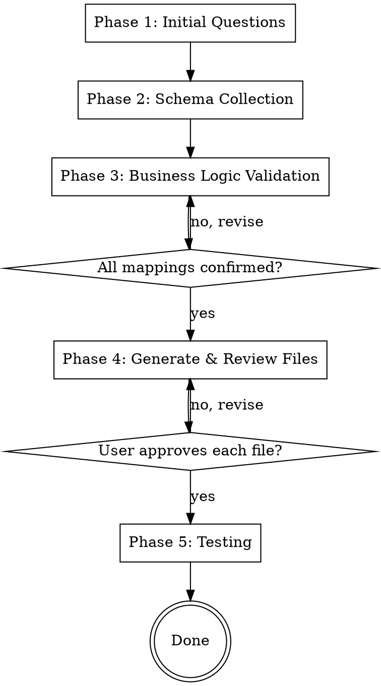

# Scaffold Snowflake Connector

## Overview

This skill scaffolds all code required to add a new snowflake-connector data source to crowd.dev. It covers up to 11 touch points, enforces zero-assumption practices, and requires explicit user validation for every piece of business logic before writing any file to disk.

**One platform, one source per run.** Multiple sources within a platform are done one run at a time.

## Process Flow



## File Inventory (All Touch Points)

Read the current state of each file before modifying. Never modify without reading first.

### Conditional — only if platform is NEW
| # | File | Change |
|---|------|--------|
| 0 | `services/libs/types/src/enums/platforms.ts` | Add `PlatformType.{PLATFORM}` enum value |

### Always — structural (template-filled)
| # | File | Change |
|---|------|--------|
| 1 | `services/libs/types/src/enums/organizations.ts` | Add to `OrganizationSource` + `OrganizationAttributeSource` enums |
| 2 | `services/libs/integrations/src/integrations/{platform}/types.ts` | NEW: activity type enum + GRID |
| 3 | `services/libs/integrations/src/integrations/index.ts` | Add `export * from './{platform}/types'` |
| 4 | `services/libs/data-access-layer/src/organizations/attributesConfig.ts` | Add to `ORG_DB_ATTRIBUTE_SOURCE_PRIORITY` |
| 5 | `backend/src/database/migrations/V{epoch}__add{Platform}ActivityTypes.sql` | NEW: INSERT into `activityTypes` |
| 6 | `services/apps/snowflake_connectors/src/integrations/types.ts` | Add `DataSourceName.{PLATFORM}_{SOURCE}` |
| 7 | `services/apps/snowflake_connectors/src/integrations/index.ts` | Import + register in `supported` |

### Per source — business logic (generated from confirmed inputs)
| # | File | Change |
|---|------|--------|
| 8 | `services/apps/snowflake_connectors/src/integrations/{platform}/{source}/buildSourceQuery.ts` | NEW |
| 9 | `services/apps/snowflake_connectors/src/integrations/{platform}/{source}/transformer.ts` | NEW |
| 10 | `services/apps/snowflake_connectors/src/integrations/{platform}/{platform}TransformerBase.ts` | NEW (optional) |

---

## Phase 1: Initial Questions

Ask one question at a time. Do not bundle questions.

### Question 1 — Platform name

Read `services/libs/types/src/enums/platforms.ts` and list all current `PlatformType` values.

Ask:
> "What is the platform name for this data source? It must match a `PlatformType` enum value. Current values are: [list them]. If your platform isn't listed, provide the name and I'll add it."

- If the value **is** in the enum: continue.
- If the value **is not** in the enum: warn the user explicitly:
  > "⚠️ `{name}` is not in the `PlatformType` enum. I'll need to add it to `services/libs/types/src/enums/platforms.ts`. Please confirm this is a new platform and confirm the exact string value (e.g., `my-platform`)."
  Wait for confirmation before proceeding.

### Question 2 — New or existing platform?

Read `services/apps/snowflake_connectors/src/integrations/index.ts`.

- If the platform already has sources registered: list them and confirm which one we're adding.
- If the platform is new to snowflake_connectors: note that touch points 0–4 and 7 will all be new additions.

### Question 3 — Source name

Ask:
> "What is the name for this data source? This becomes the directory name and `DataSourceName` enum suffix (e.g., `enrollments`, `event-registrations`)."

### Question 4 — Snowflake table

Ask:
> "What is the fully-qualified Snowflake table name for this source? Format: `DB.SCHEMA.TABLE`."

If there are JOIN tables needed (e.g., users, organizations), ask after the main table is confirmed — one JOIN table at a time.

---

## Phase 2: Schema Collection

Ask the user to run the following in Snowflake UI and paste the output:

```sql
DESCRIBE TABLE DB.SCHEMA.TABLE;
```

Parse the output to build a column registry:
- Column name (exact casing from schema — this is the reference for all code)
- Data type
- Nullable (Y/N)

**Store this as the canonical column reference. Every column name used in generated code must appear in this registry. Never assume or invent a column name.**

For each JOIN table identified in Phase 1:
- Ask the user to `DESCRIBE TABLE` that table too, one at a time
- Ask: "Is this the same table used by an existing implementation (e.g., same users or orgs table as TNC or CVENT)?"
  - If yes: read the existing transformer that uses it and follow its column mapping exactly
  - If no: treat every column as unknown — validate each one explicitly in Phase 3

---

## Phase 3: Business Logic Validation

**Rule:** Every attribute is confirmed by the user individually. Never batch multiple questions into one message. Never proceed to file generation until all sub-sections are complete.

---

### 3a. Identity Mapping

**Rule:** Every member record must produce at least one identity with `type: MemberIdentityType.USERNAME`. The fallback chain is (try in order):
1. Platform-native username column from schema
2. LFID column value (used as username on `PlatformType.LFID`)
3. Email value used as the platform USERNAME (last resort)

Ask one at a time:

1. "Which column contains the member's email address? (Required — rows where this is null will be skipped.)"
   - Verify the column is in the schema registry. If nullable=Y, note it.

2. "Is there a platform-native username column in the schema?"
   - If yes: "Which column?" — verify it's in the registry.
   - If no: note that email or LFID will be used as username fallback.

3. "Is there an LFID column in the schema?"
   - If yes: "Which column?" — verify it's in the registry.
   - If no: note it.

4. "Are there any other identity-relevant columns (e.g., a separate user ID, a profile URL)?"

5. For each confirmed identity column:
   - "Should identities from this column be `verified: true`?"
   - "What is the `verifiedBy` value?" (usually the platform type)

**Critical check:** If a JOIN table for users is not the same table used by an existing implementation, validate every column explicitly. Do not infer semantics from column names.

After all identity columns are confirmed, summarize the full identity-building logic and ask:
> "Here is how identities will be built: [summary]. Does this look correct?"

---

### 3b. Organization Mapping

Ask first: "Does this source contain organization/company data?"

If **no**: skip to 3c.

If **yes**:

Ask: "Is the org data sourced from a JOIN table already used by another platform's implementation?"

- If **yes**: read that existing implementation's `buildOrganizations` method from the codebase. Follow its column mapping exactly. Show the user what columns will be used and ask for confirmation.
- If **no** (new org table): validate each column explicitly, one at a time:
  1. Org display name column?
  2. Website column?
  3. Domain aliases column? If yes: "What is the format? (comma-separated string, array, etc.)"
  4. Logo URL column?
  5. Industry column?
  6. Employee count/size column?

**Critical — `isIndividualNoAccount`:**
Read `services/apps/snowflake_connectors/src/core/transformerBase.ts` to find `isIndividualNoAccount`. The generated code MUST call this method rather than reimplementing it. Show the user the method signature and confirm it will be used identically to existing sources.

After all org columns are confirmed, summarize and ask for confirmation before proceeding.

---

### 3c. Activity Types

**Rule:** Activity type names and scores come entirely from the user. Do not suggest them.

Ask:
> "Please list all activity types this source can produce. For each, provide:
> - A short name (e.g., `enrolled-certification`)
> - A score from 1–10
>
> I'll suggest the enum key, label, description, and flags for each one."

For each activity type the user provides, suggest the following **one at a time**, waiting for approval before moving to the next:

| Field | Suggestion rule |
|-------|----------------|
| Enum key | SCREAMING_SNAKE_CASE version of the name (e.g., `ENROLLED_CERTIFICATION`) |
| String value | The name the user provided (kebab-case) |
| Label | Human-readable (e.g., `Enrolled in certification`) |
| Description | One sentence describing the event (look at similar types in `backend/src/database/migrations/` for style) |
| `isCodeContribution` | `false` unless it involves code (check existing platforms — almost always false for non-GitHub sources) |
| `isCollaboration` | `false` unless it is a collaborative activity |

Ask: "Does this look correct for `{type_name}`? Any changes?" before moving to the next type.

---

### 3d. Timestamp & sourceId

Before asking, explain:
> "The **timestamp column** is critical — it drives all incremental exports. Records updated after the last export run are re-fetched using this column. It must never be null. If it can be null, we need to find an alternative or add a `WHERE column IS NOT NULL` guard.
>
> The **sourceId** is used as the deduplication key — if two records have the same sourceId, only one activity is kept. It must uniquely identify each logical event."

Ask:

1. "Which column is the incremental update timestamp?"
   - Check the schema registry nullable flag. If nullable=Y: "⚠️ This column is marked nullable. Can it actually be null in practice? If yes, we need an alternative column or a guard." Wait for resolution.
   - Valid examples: `updated_ts`, `enrolled_at`, `created_at`

2. "Which column uniquely identifies each record and will be used as `sourceId`?"
   - Verify it's in the schema registry.
   - Confirm: "Is this value guaranteed to be unique per logical event (not per user)?"

---

### 3e. Base Class Check

- If this is the **first source** for this platform:
  - If org mapping is present: propose creating `{platform}TransformerBase.ts` with shared `buildOrganizations` logic. Show the proposed class structure (modeled on `tncTransformerBase.ts`). Ask for confirmation.
  - If no org mapping: no base class needed; transformer extends `TransformerBase` directly.

- If the platform **already has sources**:
  - Check if `services/apps/snowflake_connectors/src/integrations/{platform}/{platform}TransformerBase.ts` exists.
  - If yes: new transformer should extend it. Confirm with user.
  - If no: new transformer extends `TransformerBase` directly.

---

### 3f. Project Slug for Testing

Ask:
> "Please provide a `project_slug` from CDP_MATCHED_SEGMENTS that has data in this Snowflake table. It should have a moderate number of records (ideally under a few thousand) and ideally cover all the activity types we're implementing. This slug will be used to restrict the test query and for the staging non-prod guard in `buildSourceQuery`."

---

## Phase 4: File Generation & Review

Generate files in the order listed in the File Inventory. For **each file**:
1. Show the complete file content in a code block
2. Ask: "Does this look correct? Any changes before I write it?"
3. Only write the file after the user explicitly confirms

Read each target file before modifying it.

---

### Structural Files (touch points 0–7)

These are template-filled from confirmed inputs. No business logic reasoning required.

**Touch point 0 — `platforms.ts`** (only if new platform)

Add `{PLATFORM} = '{platform-string}',` to the `PlatformType` enum in alphabetical order among the non-standard entries.

---

**Touch point 1 — `organizations.ts`**

File: `services/libs/types/src/enums/organizations.ts`

Add to both enums:
- `OrganizationSource.{PLATFORM} = '{platform-string}'`
- `OrganizationAttributeSource.{PLATFORM} = '{platform-string}'`

---

**Touch point 2 — `{platform}/types.ts`** (new file)

File: `services/libs/integrations/src/integrations/{platform}/types.ts`

Template (fill with confirmed activity types and scores):

```typescript
import { IActivityScoringGrid } from '@crowd/types'

export enum {Platform}ActivityType {
  {ENUM_KEY} = '{string-value}',
  // ... one entry per confirmed activity type
}

export const {PLATFORM}_GRID: Record<{Platform}ActivityType, IActivityScoringGrid> = {
  [{Platform}ActivityType.{ENUM_KEY}]: { score: {score} },
  // ... one entry per confirmed activity type
}
```

---

**Touch point 3 — `integrations/index.ts`**

File: `services/libs/integrations/src/integrations/index.ts`

Add before `export * from './activityDisplayService'`:
```typescript
export * from './{platform}/types'
```

---

**Touch point 4 — `attributesConfig.ts`**

File: `services/libs/data-access-layer/src/organizations/attributesConfig.ts`

Add `OrganizationAttributeSource.{PLATFORM},` to the `ORG_DB_ATTRIBUTE_SOURCE_PRIORITY` array, positioned after the most recently added snowflake platform (currently after `OrganizationAttributeSource.TNC`).

---

**Touch point 5 — Flyway migration** (new file)

File: `backend/src/database/migrations/V{Date.now()}__add{Platform}ActivityTypes.sql`

Template (use epoch timestamp for `V` prefix — run `date +%s%3N` in terminal):

```sql
INSERT INTO "activityTypes" ("activityType", platform, "isCodeContribution", "isCollaboration", description, "label") VALUES
('{string-value}', '{platform-string}', {false|true}, {false|true}, '{description}', '{label}'),
-- ... one row per confirmed activity type, last row without trailing comma
('{string-value}', '{platform-string}', {false|true}, {false|true}, '{description}', '{label}');
```

---

**Touch point 6 — `snowflake_connectors/types.ts`**

File: `services/apps/snowflake_connectors/src/integrations/types.ts`

Add to `DataSourceName` enum:
```typescript
{PLATFORM}_{SOURCE} = '{source-name}',
```

---

**Touch point 7 — `snowflake_connectors/index.ts`**

File: `services/apps/snowflake_connectors/src/integrations/index.ts`

Add import at top:
```typescript
import { buildSourceQuery as {platform}{Source}BuildQuery } from './{platform}/{source}/buildSourceQuery'
import { {Platform}{Source}Transformer } from './{platform}/{source}/transformer'
```

Add to `supported` object under the platform key (create the key if new platform):
```typescript
[PlatformType.{PLATFORM}]: {
  sources: [
    {
      name: DataSourceName.{PLATFORM}_{SOURCE},
      buildSourceQuery: {platform}{Source}BuildQuery,
      transformer: new {Platform}{Source}Transformer(),
    },
  ],
},
```

If the platform already exists, append to its `sources` array instead of creating a new key.

---

### Business Logic Files (touch points 8–10)

These are AI-generated from the confirmed column mappings. Apply all rules strictly.

---

**Touch point 8 — `buildSourceQuery.ts`** (new file)

File: `services/apps/snowflake_connectors/src/integrations/{platform}/{source}/buildSourceQuery.ts`

**Rules (enforced — do not deviate):**
- Use explicit column names only. Never use `table.*`
- If any TIMESTAMP_TZ columns exist in the schema, exclude and re-cast them as TIMESTAMP_NTZ (see CVENT pattern)
- Follow the CTE structure:
  1. `org_accounts` CTE (if org data present)
  2. `CDP_MATCHED_SEGMENTS` CTE (always)
  3. `new_cdp_segments` CTE (inside the `sinceTimestamp` branch only)
- Incremental pattern: when `sinceTimestamp` is provided, UNION two queries:
  - Records where the confirmed timestamp column `> sinceTimestamp`
  - Records in newly created segments (using `new_cdp_segments`)
- Deduplication: `QUALIFY ROW_NUMBER() OVER (PARTITION BY {sourceId_column} ORDER BY {dedup_key} DESC) = 1`
- Non-prod guard: `if (!IS_PROD_ENV) { select += \` AND {table}.{project_slug_column} = '{confirmed_project_slug}'\` }`
- All column names must match the confirmed schema registry exactly

Show the full generated file and ask for confirmation before writing.

---

**Touch point 9 — `transformer.ts`** (new file)

File: `services/apps/snowflake_connectors/src/integrations/{platform}/{source}/transformer.ts`

**Rules (enforced — do not deviate):**
- All string comparisons must be case-insensitive: use `.toLowerCase()` on both sides of comparison only; preserve the original value in the output
- No broad `else` statements — every branch must have an explicit condition
- All column names referenced in code must exactly match the schema registry — never assumed
- Identity fallback chain (always produces at least one USERNAME identity):
  1. If platform-native username column present and non-null → push EMAIL + USERNAME identities for platform
  2. Else if LFID present and non-null → push EMAIL for platform + LFID value as USERNAME for platform
  3. Else → push EMAIL value as USERNAME for platform (email-as-username)
- After building platform identities, if LFID column is present and non-null → push separate LFID identity: `{ platform: PlatformType.LFID, value: lfid, type: MemberIdentityType.USERNAME, ... }`
- `isIndividualNoAccount` must call `this.isIndividualNoAccount(displayName)` from `TransformerBase` — never reimplement
- Extends the platform base class if one was confirmed in Phase 3e; otherwise extends `TransformerBase` directly
- If in doubt about any mapping: ask the user before writing

Show the full generated file and ask for confirmation before writing.

---

**Touch point 10 — `{platform}TransformerBase.ts`** (new file, only if confirmed in Phase 3e)

File: `services/apps/snowflake_connectors/src/integrations/{platform}/{platform}TransformerBase.ts`

Model on `tncTransformerBase.ts`. Contains only the shared `buildOrganizations` logic. Abstract class that extends `TransformerBase` and sets `readonly platform = PlatformType.{PLATFORM}`.

Show the full generated file and ask for confirmation before writing.

---

## Phase 5: Testing

After all files are written, provide the user with a test query:

Take the `buildSourceQuery` output (without `sinceTimestamp`, so the full-load variant), substitute the non-prod project_slug guard with the confirmed `project_slug`, and add `LIMIT 100`:

```sql
-- Example shape (exact SQL comes from the generated buildSourceQuery):
WITH org_accounts AS (...),
cdp_matched_segments AS (...)
SELECT
  -- all explicit columns
FROM {table} t
INNER JOIN cdp_matched_segments cms ON ...
WHERE t.{project_slug_column} = '{confirmed_project_slug}'
QUALIFY ROW_NUMBER() OVER (...) = 1
LIMIT 100;
```

Instruct the user:
> "Please run this query in Snowflake and paste the result (JSON or CSV). I'll walk through each row and verify the transformer logic produces the expected `IActivityData` before we consider this done."

### Dry-Run Validation

When the user pastes results, for each row:
- Apply transformer logic in-chat (show inputs → outputs)
- Show the resulting `IActivityData` + segment slug
- Flag immediately: null email, missing USERNAME identity, unexpected activity type, null sourceId, null timestamp
- If any issue found: loop back to the relevant Phase 3 sub-section, fix the mapping, regenerate the affected file

### Completion Checklist

Before declaring the implementation complete, verify every item:

- [ ] All applicable files from the File Inventory written to disk
- [ ] No `table.*` anywhere in any generated query
- [ ] No broad `else` in any transformer
- [ ] All string comparisons are case-insensitive (`.toLowerCase()` on both sides of comparison)
- [ ] `sourceId` confirmed unique in test data
- [ ] Timestamp column confirmed never null in test data
- [ ] All activity types present in test data (or user explicitly acknowledged any absent ones)
- [ ] `isIndividualNoAccount` behavior verified matches existing sources

---

## Anti-Hallucination Rules

These apply throughout the entire skill execution. They are non-negotiable.

1. **Never assume a column exists.** Every column reference must come from the pasted `DESCRIBE TABLE` output or a confirmed JOIN table schema.
2. **Never assume a JOIN table is the same as an existing one.** If a table has not been verified against an existing implementation, validate every column.
3. **Never suggest activity type names or scores.** These come from the user.
4. **Never write a file without showing it first and receiving explicit user approval.**
5. **When in doubt, ask.** A question costs seconds. A wrong implementation costs hours.
6. **One question per message.** Never bundle multiple validations.
7. **Read before modifying.** Read every file before making changes to it.
