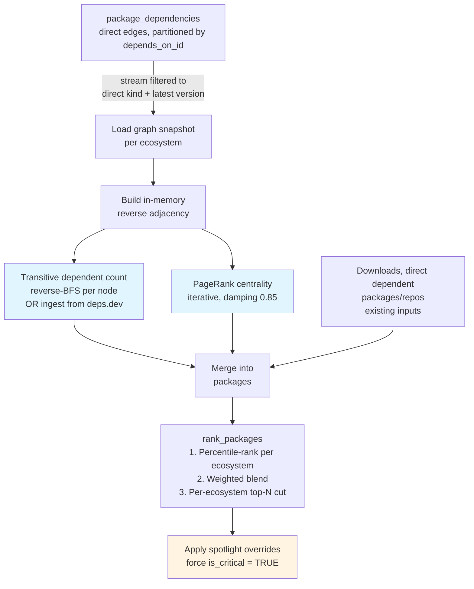

# ADR-0001: OSS packages — design decisions (living)

**Date**: 2026-05-27
**Status**: living
**Deciders**: CDP/Insights team

## Context

The oss-packages domain is being built inside CDP as a new, independent capability — tracking open-source packages, dependency graphs, repositories, security advisories, and maintainers. The domain is pre-production: schema, ingestion workers, and the data model are all actively evolving. This document is the single living record of design decisions for oss-packages, updated in place as decisions are refined. At first production release the team will decide whether to seal it as `accepted` or split it into per-area ADRs; that decision is recorded in the Changelog at the bottom.

## Scope and current status

| Decision area                                  | Status                                              |
| ---------------------------------------------- | --------------------------------------------------- |
| Database placement                             | decided                                             |
| Worker architecture                            | decided                                             |
| Universe source and critical-package selection | decided                                             |
| Criticality scoring methodology                | proposed (weights tunable)                                          |
| Write semantics across sub-workers             | decided                                             |
| Package → repository provenance                | decided                                             |
| OSV as canonical security source               | decided                                             |
| CVSS scoring strategy                          | decided (v4 numeric scoring deferred)               |
| `has_critical_vulnerability` semantics         | decided                                             |
| `advisory_affected_ranges` uniqueness scope    | decided                                             |
| Per-source ingestion strategies                | decided (Sonatype API access pending)               |
| Source of truth: deps.dev vs registries / OSV  | decided                                             |
| deps.dev coverage and gaps                     | decided                                             |
| Downloads timeline by tier                     | decided                                             |

---

## Decisions

### Database placement

The packages schema has no FK relationships into either existing CDP database (`crowd-web`, `product-db`), and requires partitioned tables sized for 90M+ versions and 1.15B+ dependency rows — a scale profile that would cause resource contention if mixed with CDP's community-activity tables.

We store all packages-domain data in a dedicated physical Postgres instance (`packages-db`, port 5434) with its own Flyway migration path (`backend/src/osspckgs/migrations/`), following the same Dockerfile and migration-script pattern used by `product-db`. Schema and connection code live entirely within the `packages_worker` service. Read/write host split is prepared in env vars (`CROWD_PACKAGES_DB_READ_HOST` / `CROWD_PACKAGES_DB_WRITE_HOST`) but only the write host is wired in `config.ts` today — read routing is deferred.

**Partitioning rationale:**

| Table                  | Strategy                       | Buckets   | Hot query shape                                                                                |
| ---------------------- | ------------------------------ | --------- | ---------------------------------------------------------------------------------------------- |
| `versions`             | HASH(`package_id`)             | 32        | Lookup by package — lands in one partition; ~2.8M rows each at 90M total                       |
| `package_dependencies` | HASH(`depends_on_id`)          | 64        | "Who depends on vulnerable package X?" — lands in one partition; ~18M rows each at 1.15B total |
| `downloads_daily`      | RANGE(`date`) via `pg_partman` | automatic | Time-series; pruning old partitions is straightforward                                         |

**`package_dependencies` query trade-off**: partitioning on `depends_on_id` makes upstream queries fast — "which packages depend on X?" lands in one partition. The inverse — "what does package Y depend on?" (lookup by `package_id`, not `depends_on_id`) — is a cross-partition scan. The upstream direction is the security-critical hot path (vulnerability blast-radius analysis), so this trade-off is intentional.

**Decided**: 2026-05-25

---

### Worker architecture

All packages_worker sub-workers live in a single npm package (`services/apps/packages_worker`) and are built from one Dockerfile (`scripts/services/docker/Dockerfile.packages-worker`). Each sub-worker is a self-contained directory under `services/apps/packages_worker/src/{worker}/` with its own logic, types, and database access. Each is launched as a separate container using a different entry point command, sharing the same image. Config helpers (`requireEnv`, `requireEnvInt`) and the packages-db connection are shared across all entry points.

```
services/apps/packages_worker/
  src/
    bin/
      github-repos-enricher.ts
    enricher/                 ← github-repos-enricher logic
    npm/                      ← npm worker (future)
    deps-dev/                 ← deps.dev worker (future)
    osv/                      ← OSV worker (future)
    config.ts                 ← shared requireEnv / requireEnvInt
    db.ts                     ← shared packages-db connection
```

Adding a new data source means adding `src/{worker}/` and a new compose service entry — no new npm package, no new Dockerfile.

**Temporal integration**: the service is initialized with `temporal: { enabled: true }` and registers a `packages-worker` task queue. Each ingestion sub-worker defines its workflows under `src/{worker}/workflows.ts`, its activities under `src/{worker}/activities.ts`, and its schedule under `src/{worker}/schedule.ts`. Schedules use `ScheduleOverlapPolicy.SKIP` so a slow run does not queue a second execution. Central re-exports live in `src/workflows/index.ts` and `src/activities.ts`. The `github-repos-enricher` currently runs as a direct polling loop rather than a Temporal workflow — migrating it is deferred until the broader ingestion patterns stabilize.

**Decided**: 2026-05-25

---

### Universe source and critical-package selection

Tier 2 enriches a critical slice of the npm and Maven ecosystems — not the full registry. We need a signal-rich, affordable source to rank the ~4–5M packages and decide which top-N to fully enrich.

We use the [deps.dev BigQuery public datasets](https://deps.dev) — specifically `PackageVersionsLatest`, `DependentsLatest`, `PackageVersionToProjectLatest`, and `ProjectsLatest` — filtered to `System IN ('NPM', 'MAVEN')` as the universe input. The BigQuery data is exported to Parquet files and imported into `packages` on a weekly cadence aligned with deps.dev's own refresh interval. The first run is a one-time full backfill; subsequent weekly imports only pull rows whose deps.dev snapshot date has advanced since the previous import, so the export size and write volume are scoped to actual diffs rather than the full universe. A scoring + ranking job then sets `is_critical = true` and `rank_in_ecosystem` directly on `packages`.

The scoring formula, per-ecosystem critical-package quotas, graph-signal inputs, and spotlight-override mechanism are defined in §Criticality scoring methodology below. The ranking function takes `critical_top_n_by_ecosystem` as a JSONB parameter and weights as numeric inputs, so thresholds and formula coefficients can be tuned at call time without a schema change.

The BigQuery free tier is approximately 1 TiB/month. Column projection and `System` filtering are mandatory on every query; full-table scans will exhaust the quota.

**Decided**: 2026-05-26

---

### Criticality scoring methodology

The §Universe source section above establishes that `rank_packages()` produces the criticality scores. This section locks in **what goes into the score** — replacing the placeholder formula (`X * downloadsCount + Y * dependentCount`) with a defensible methodology that captures load-bearing upstream packages (the left-pad / XZ pattern), normalizes across ecosystems, and supports manual overrides for known-critical primitives.

This is treated as a brand-new workstream: no reuse or extension of any existing in-flight criticality code. All code lives inside `services/apps/packages_worker/src/criticality/` following the §Worker architecture pattern (`activities.ts`, `workflows.ts`, `schedule.ts`, queries co-located in the same directory). No additions to `services/libs/data-access-layer` — consistent with how other sub-workers like `osv` and `enricher` keep DB access local to the worker.

#### Inputs

Five signals, all stored on `packages`:

| Signal                       | Existing? | Source                                                                  |
| ---------------------------- | --------- | ----------------------------------------------------------------------- |
| `downloads_last_30d`         | yes       | weekly downloads ingestion (registry APIs)                              |
| `dependent_packages_count`   | yes       | deps.dev `DependentsLatest`                                             |
| `dependent_repos_count`      | yes       | derived in Postgres from `package_repos`                                |
| `transitive_dependent_count` | **new**   | computed in the criticality sub-worker (see Implementation note below) |
| `centrality_score`           | **new**   | computed in the criticality sub-worker (PageRank, see below)            |

Direct dependent counts capture popularity. Transitive dependent count and centrality capture **blast radius** — load-bearing upstream packages with few direct dependents but massive indirect reach (the left-pad / XZ class that direct counts alone miss).

PageRank centrality is the primary blast-radius signal; transitive dependent count is stored as a sanity check / floor, not as an equal-weight input. The two are correlated — PageRank is a weighted refinement of transitive count, where a package's score depends recursively on the importance of who depends on it. Blending them as independent signals would double-count blast radius. Both columns are stored so weights can be tuned without rerunning the graph job.

#### Scoring formula

Per-ecosystem percentile-rank of each log-transformed signal, then weighted blend:

```
impact =  w_downloads   * pct_rank( LOG(1 + downloads_last_30d)         )   within ecosystem
        + w_dep_pkgs    * pct_rank( LOG(1 + dependent_count)            )   within ecosystem
        + w_transitive  * pct_rank( LOG(1 + transitive_dependent_count) )   within ecosystem
```

Weights sum to 1.0 → impact ∈ `[0, 1]`. `dependent_count` is direct dependent packages only; `transitive_dependent_count` is indirect dependents only. All weights are call-time numeric parameters to `rank_packages()` — tunable without schema or code changes.

`centrality_score` (PageRank) is computed and stored on `packages` by the criticality worker and will be added to the formula if needed.

**Current weights** (defaults in `rank_packages()`, iterate once the ranked list is observable):

| Weight          | Value | Signal                      | Rationale                                                            |
| --------------- | ----- | --------------------------- | -------------------------------------------------------------------- |
| `w_transitive`  | 0.50  | Indirect dependent packages | Primary blast-radius signal — captures packages invisible to direct counts |
| `w_dep_pkgs`    | 0.25  | Direct dependent packages   | Popularity within the package graph                                  |
| `w_downloads`   | 0.25  | 30-day downloads            | Adoption signal, balanced with dependency reach                      |

These are a starting point, not a recommendation we've validated. They will be revised once the first ranked list is observable and stakeholders review which packages land in / near Tier 1 — particularly for smaller ecosystems where the percentile distribution is less stable.

**Why percentile-rank, not min-max:** even after log-transform, heavy-tailed signals retain extreme outliers that bend the min-max scale. Example — downloads `[10, 100, 1000, 10000, 1B]` log-transformed are `[2.4, 4.6, 6.9, 9.2, 20.7]`. Min-max on those gives `[0.00, 0.12, 0.25, 0.37, 1.00]` (four out of five squeezed below 0.4); percentile-rank gives uniform `[0.00, 0.25, 0.50, 0.75, 1.00]`, stable to outliers, and `0.5` means "median within ecosystem" regardless of which ecosystem.

**Why per-ecosystem:** the percentile uses `PARTITION BY ecosystem` so ecosystems are never compared on the same absolute scale. A top-percentile crates package is strategically important; without per-ecosystem partitioning it would be buried by npm's volume.

#### Per-ecosystem tier budgets

`rank_packages()` already takes `critical_top_n_by_ecosystem` as a JSONB parameter that ranks within each ecosystem and cuts at top N.

Allocation policy is **floor + ceiling + judgment**: every onboarded ecosystem gets a minimum (the floor — guarantees representation regardless of size), no single ecosystem exceeds a percentage of the total (the ceiling — prevents npm from swallowing the list). Illustrative values for a 700k Tier 2 budget:

| Ecosystem  | Tier 2 budget | Tier 1 budget |
| ---------- | ------------- | ------------- |
| npm        | 300k          | 50k           |
| Maven      | 150k          | 25k           |
| PyPI       | 100k          | 15k           |
| crates     | 75k           | 5k            |
| Go modules | 75k           | 5k            |
| **Total**  | **700k**      | **100k**      |

Specific numbers are a stakeholder decision; the rationale per ecosystem must live alongside the JSONB config so the "why these values?" question is answerable later. Avoid proportional-to-ecosystem-size — it amplifies npm dominance, the opposite of what we want.

#### Spotlight overrides

A new `package_criticality_spotlight` table keyed on `(ecosystem, namespace, name)` carries required `rationale`, `added_by`, `added_at` columns. Rows in this table are flagged `is_critical = TRUE` regardless of computed score. Applied **after** ranking inside the criticality workflow so spotlights are not overwritten on the next pass. Rationale-per-row is deliberate: the safety net stays auditable as it grows.

The spotlight exists because the methodology has a known structural blind spot — packages that are critical but rarely depended on in the observable graph (vendored code, build-time-only tools, dependencies pulled outside the registry). No combination of graph signals will surface these; manual curation is the only path.

#### Implementation note: in-memory graph computation vs deps.dev ingestion

The in-memory build of `transitive_dependent_count` and `centrality_score` is a **direct consequence of the §Database placement and §Worker architecture decisions to store only direct dependencies on `package_dependencies`**. Materializing the full transitive closure would be ~1.5B rows; storing might not be viable at this point, so transitive signals must be computed at scoring time. The chosen approach: stream direct edges into memory per ecosystem (~10M nodes / ~100M edges for npm fits in ~2 GB RAM on a single worker box), compute transitive counts via reverse-BFS and PageRank centrality iteratively (damping 0.85, ~100 iterations, converges on `1e-6`), bulk-merge results into `packages`. No graph DB, no distributed framework.

**Before committing to this implementation, confirm whether deps.dev already provides these signals so we can ingest instead of compute:**

- **Transitive dependent count** — `DependentsLatest` is the table we already source `dependent_packages_count` from. Verify whether its dependent counts are direct-only or include indirect dependents. If indirect counts are included, the column can be sourced in the existing universe-import job (consistent with how the other dependent counts are already populated) and the in-memory transitive computation is unnecessary.
- **Centrality / importance score** — deps.dev does not appear to expose a PageRank-style score in its current schema.

If both signals are ingestible, the criticality sub-worker reduces to "call `rank_packages()` with the right weights" — much simpler. If only one is ingestible, the in-memory job still runs but does less work. Either way the §deps.dev coverage and gaps table below must be updated to record what's sourced from where.

#### Worker layout

A new directory `services/apps/packages_worker/src/criticality/` with the standard sub-worker layout (`activities.ts`, `workflows.ts`, `schedule.ts`, queries co-located), and `src/bin/criticality-worker.ts` as its entrypoint. Weekly cadence, one workflow per ecosystem, `ScheduleOverlapPolicy.SKIP`. Workflow steps: load graph snapshot → compute transitive counts and PageRank (or skip if ingested from deps.dev) → merge results into `packages` → call `rank_packages()`.

#### High-level flow



Inputs in blue are new graph-derived signals; the spotlight step in orange is the deliberate safety net for the methodology's structural blind spot.

#### Additional Decisions

- **Edge filter**: `dependency_kind = 'direct'` only — exclude `dev` and `peer` (they don't represent runtime blast radius).
- **Version resolution**: each package's latest non-yanked, non-prerelease version (uses existing `versions.is_latest` / `is_yanked` / `is_prerelease`).
- **Graph scope**: per-ecosystem; don't merge ecosystems into a single graph. Cross-ecosystem edges are rare and noisy.
- **Score range**: `[0, 1]` (weights sum to 1.0). Score interpretation: weighted average percentile across signals within ecosystem. Tier membership is determined by rank, not by score threshold.
- **Cadence**: weekly, aligned with the existing universe refresh.

**Weights are expected to change.** The starting weight vector (centrality heaviest, transitive kept low as a sanity floor, downloads and direct dependents lighter) is a judgment-based initial bias, not a validated configuration. Once the ranked list is observable, weights will be tuned based on stakeholder review of which packages land where — particularly at the Tier 1 boundary and for smaller ecosystems. Because weights are call-time numeric parameters to `rank_packages()`, retuning does not require a schema change, code change, or redeploy. Expect multiple iterations before weights are locked in.

**Status**: proposed — 2026-05-29. Formula shape, inputs, tier-budget policy, and spotlight table are agreed. Open: (1) whether transitive counts can be sourced from deps.dev before in-memory PageRank work begins; (2) final weight values, which will be tuned against an observable ranked list.

---

### Write semantics across sub-workers

Five sub-workers run concurrently (npm, Maven, OSV, GitHub, Docker Hub), all writing to the same `packages-db` schema. We define per-table write rules that allow concurrent writes without distributed locking:

| Table                                 | Rule                                                                                                                                                                                                                                                        |
| ------------------------------------- | ----------------------------------------------------------------------------------------------------------------------------------------------------------------------------------------------------------------------------------------------------------- |
| `packages`                            | Upsert on `purl`. Each worker only writes columns it owns; ecosystem isolation means column-level conflicts cannot occur in practice.                                                                                                                       |
| `versions`                            | Append-only via `INSERT … ON CONFLICT DO NOTHING`. Yanked/deprecated status is a separate targeted `UPDATE (is_yanked = true) WHERE …`.                                                                                                                     |
| `repos`                               | Registry workers (npm, Maven) do **not** write `repos` enrichment metadata. They INSERT a minimal `repos(url, host)` row — `url` (canonical) and `host` (coarse classification) are both derived from the declared repository URL — solely to create the FK target their `package_repos` link needs. `owner`/`name`/`stars`/`description` and all other metadata stay NULL and remain enricher-owned; existing rows are never updated by registry workers. The GitHub enricher — triggered when `repos.last_synced_at IS NULL` — upserts `repos` with metadata. Docker Hub worker adds `docker_*` columns on top. |
| `package_repos`                       | Composite PK `(package_id, repo_url)`. Each `source` value ('declared', 'deps_dev', 'heuristic', 'manual') is a separate row — sources do not overwrite each other.                                                                                         |
| `advisories`                          | Upsert on `osv_id`. OSV is the single source of truth; no other worker writes to this table.                                                                                                                                                                |
| `maintainers` / `package_maintainers` | `maintainers`: upsert on `(ecosystem, username)`, never deleted — the identity history is preserved. `package_maintainers`: reflects the **current** link set — the npm worker replaces a package's links each ingest (delete + reinsert), so prior link rows are not retained.                                                                                                                                                                                     |
| `downloads_daily`                     | Append-only time-series. Each `(package_id, date)` row is written once. npm and Maven workers own disjoint rows by ecosystem. Historical timelines are preserved — workers do not overwrite past dates.                                                     |
| `downloads_last_30d`                  | Upsert on `(purl, end_date)`. Written by the weekly ranking worker only. The cached `packages.downloads_last_30d` column must be updated in the same pass.                                                                                                  |

The column-ownership rule is a social contract, not enforced by Postgres. Code review must catch cross-ecosystem or cross-source column writes using this table as the reference.

**Decided**: 2026-05-26

---

### Package → repository provenance

A package's source repository is central to Tier 2 analytics (Scorecard, stars, commit activity). Maintainers sometimes publish incorrect URLs, monorepos host many packages, and multiple sources propose URLs at different reliability levels.

The `package_repos` table is one-to-many: one package may map to multiple candidate repo URLs; one repo may host many packages. Each row carries:

- `source`: `'declared'` (from package manifest) | `'deps_dev'` | `'heuristic'` (name-based guess) | `'manual'` (human curation)
- `confidence`: 0.00–1.00 — declared ≈ 0.80, deps_dev ≈ 0.90, heuristic ≈ 0.50, manual = 1.00

All repo URLs are **canonicalized** before insertion: scheme normalized to `https`, host lowercased, trailing `.git` stripped, trailing slash stripped, and path case lowercased for GitHub/GitLab. The canonical URL is the `repos.url` primary key and FK target in `package_repos`. Canonicalization must be a shared utility (not reimplemented per worker) with unit tests covering edge cases before the first worker ships.

The `packages` table retains `declared_repository_url` (raw) and `repository_url` (canonical highest-confidence match) as denormalized copies for quick access.

**Population order**:

1. Registry workers (npm, Maven) write `packages` and `package_repos` rows.
2. The GitHub enricher polls `repos` for rows where `skip_enrichment = false` and `last_synced_at IS NULL` (never enriched) or `last_synced_at < NOW() - INTERVAL '<configurable hours>'` (stale). The re-sync interval is controlled via `ENRICHER_REPO_UPDATE_INTERVAL_HOURS`.
3. The enricher updates those rows with full metadata and sets `last_synced_at`. Permanently unreachable repos (deleted, private, IP-allowlisted) are marked `skip_enrichment = true` and not retried.
4. Subsequent enricher runs pick up new repos added since the last pass.

`repos` rows are current-state only — no historical snapshots; each enricher run overwrites previous metadata values.

**Decided**: 2026-05-26

---

### OSV as canonical security source

Tier 2 exposes a `has_critical_advisory` flag per package. We need a security advisory source covering both npm and Maven, available in bulk, with structured version ranges. The repo has prior art on OSV parsing in `services/apps/git_integration/src/crowdgit/services/vulnerability_scanner/`.

We ingest the OSV bulk ZIP — full download daily, not incremental — into `advisories` and `advisory_affected_ranges`, with no JSONB. Each advisory row captures `osv_id`, `aliases`, `ecosystem`, `package_name`, `severity`, `cvss`, `summary`, `details`, `published_at`, `modified_at`. `is_critical` is a `GENERATED ALWAYS AS (cvss >= 7.0) STORED` column.

**v1 ecosystem allowlist**: only `npm` and `maven` advisories are processed; all others are skipped at parse time.

**Multi-package advisories**: `advisories.package_name` holds the first affected package (primary lookup for single-package advisories, the majority). The full affected list is in `advisory_affected_ranges`, one row per `(osv_id, ecosystem, package_name)`.

**Severity fallback** (many OSV records carry no CVSS vector):

| Qualitative severity | Synthesized cvss |
| -------------------- | ---------------- |
| `CRITICAL`           | 9.5              |
| `HIGH`               | 7.5              |
| `MEDIUM`             | 5.0              |
| `LOW`                | 3.0              |

The qualitative `severity` tag is stored alongside the synthesized value so consumers can distinguish real CVSS from approximations.

**Ecosystem normalization**:

| OSV raw value | Stored as |
| ------------- | --------- |
| `npm`         | `npm`     |
| `Maven`       | `maven`   |

**Derivation cadence**: `deriveCriticalFlag` runs at the end of each OSV sync pass in the same worker loop — no separate scheduler needed.

**`has_critical_vulnerability` flag**: see the [§`has_critical_vulnerability` semantics](#has_critical_vulnerability-semantics) section below.

The ingest worker must stream-parse the bulk ZIP rather than loading it into memory.

**Decided**: 2026-05-26

---

### CVSS scoring strategy

OSV records carry severity as a `severity[]` array of `{type, score}` entries, where `type` is `CVSS_V2 | CVSS_V3 | CVSS_V4 | …` and `score` is the **vector string** (e.g. `CVSS:3.1/AV:N/AC:L/PR:N/UI:N/S:C/C:H/I:H/A:H`), not a numeric base score. We compute the numeric base score inline from the FIRST v3.1 specification (~80 LOC in `services/apps/packages_worker/src/osv/cvssScoring.ts`), without a third-party CVSS dependency.

Scoring fallback chain (in `extractSeverity.ts`):

1. `MAL-*` id → `cvss = NULL`, `cvss_source = 'osv_malicious_package'`.
2. CVSS_V3 vector → compute inline, `cvss_source = 'osv_cvss_v3'`.
3. `database_specific.severity` qualitative tag → synthesized per the severity-fallback table in §OSV, `cvss_source = 'osv_qualitative_fallback'`.
4. Nothing → `cvss = NULL` and `cvss_source = NULL`.

Scope (`S`) metric is validated against `{U, C}` up front; a missing or invalid `S` returns `null` from the score function rather than silently falling through to the Scope:Unchanged formula.

**CVSS v4 is deferred.** Computing v4 base scores requires the ~270-entry macro-vector lookup table from the FIRST v4.0 spec; the validation effort to verify it against reference vectors is its own slice of work. V4-only OSV records (no V3 sibling vector and no qualitative tag — ~1.1% of advisories as of 2026-05-27) land with `cvss = NULL`. The `cvss_source` column allows downstream consumers to distinguish synthesized-from-qualitative scores (`osv_qualitative_fallback`) from real V3 base scores (`osv_cvss_v3`), and the V4-NULL bucket is queryable for follow-up sizing (`SELECT COUNT(*) FROM advisories WHERE cvss_source IS NULL`).

The inline implementation is unit-tested against six FIRST-published reference vectors (log4shell 10.0, shellshock 9.8, heartbleed 7.5, ChangeCipherSpec 4.8, a low-end vector at 3.3, and an all-None at 0.0), plus regression guards for missing-`S` and `S:X`.

**Trade-off considered:** adopting a third-party CVSS package (e.g. npm `cvss` or a v4-capable alternative) was rejected — `cvss` covers v2/v3 only, so we'd still own the v4 problem; v4-capable libraries are recent and require validating against reference vectors anyway. Inline code we can unit-test against FIRST-published scores is the lower-risk path for a security-critical formula.

**Decided**: 2026-05-27

---

### `has_critical_vulnerability` semantics

`packages.has_critical_vulnerability = TRUE` iff there exists an advisory `a` such that:

- `a.is_critical = TRUE` (CVSS ≥ 7.0) OR `a.osv_id LIKE 'MAL-%'` (malicious-package report), AND
- The package's current `latest_version` falls inside one of `a`'s affected ranges per the ecosystem comparator (semver for npm, a Maven `ComparableVersion`-style comparator for Maven).

A range `(introduced, fixed, last_affected)` matches `latest_version` when:

- `introduced IS NULL OR introduced = '0' OR latest_version >= introduced`, AND
- `fixed IS NULL OR latest_version < fixed`, AND
- `last_affected IS NULL OR latest_version <= last_affected`.

This is **option (b)** (latest_version inside an active range), plus a **MAL- override** so malicious-package reports flip the flag regardless of CVSS — the XZ-style maintainer-compromise case. ~213k of 220k npm OSV records are `MAL-*` with `cvss = NULL`, so option (b) on its own would miss the dominant security signal.

**Why not option (a)** (any critical advisory exists for the package name, regardless of version): option (a) over-reports — a CVE patched in v1.0 flags a package now on v9.0 — and under-reports when an advisory has multiple `affected[]` ranges where only some are patched. The actionable consumer question is "is the version I'd install today vulnerable?", and that's option (b).

**Why not SQL-only derivation:** Postgres has no native semver or Maven `ComparableVersion` comparator. Implementing either as a `plpgsql` function is a significantly larger maintenance surface than the ~120 LOC TypeScript equivalent and would need re-validation against every Postgres minor-version upgrade.

**Maintenance.** `deriveCriticalFlag` (the second activity in the `osvSync` workflow) recomputes the flag for every package whose `latest_version` is non-null. Both the FALSE → TRUE and TRUE → FALSE transitions are handled idempotently. A catch-up resolver populates `advisory_packages.package_id` for advisories that arrived before the matching package was ingested — at most one OSV cycle lag (~24h) for late-arriving packages.

The ecosystem-specific comparators are TypeScript (`services/apps/packages_worker/src/osv/versionCompare.ts`), unit-tested with 30 cases covering Maven qualifier ranks (alpha < beta < milestone < rc < snapshot < ga/final < sp), qualifier aliases (`final` / `release` / `ga` / empty all equal), cross-ecosystem null returns, and the `1.0-final == 1.0` edge case.

**Known gap.** Packages without `latest_version` are skipped and remain FALSE regardless of matching advisories. V4-only advisories without a V3 sibling or qualitative tag (`cvss_source IS NULL`) do not contribute to the flag — see the CVSS scoring strategy section.

**Decided**: 2026-05-28 (resolves the prior open question on this flag)

---

### `advisory_affected_ranges` uniqueness scope

`advisory_affected_ranges` uses a full-tuple unique index `(advisory_package_id, COALESCE(introduced_version, ''), COALESCE(fixed_version, ''), COALESCE(last_affected, ''))` rather than the narrower `(advisory_package_id, introduced_version)`.

The narrower form forces two ranges that share an `introduced_version` but differ in `fixed_version` or `last_affected` to collapse into one row — a real OSV case (cross-distro patches, partial fixes within a single advisory) — and silently drops the wider range. When the surviving range is the narrower one, the package's actual vulnerable window is under-reported and `has_critical_vulnerability` returns FALSE for versions inside the wider range. The full-tuple key preserves the §Write semantics principle "one package has many version ranges; no denormalization."

The application-side `dedupeRanges` in `upsertAdvisory.ts` keys on the same full tuple so the pre-flight matches the database constraint exactly. Truly identical tuples (the original "OSV emits a redundant event on the same line" case) still collapse; ranges that differ in any component are all preserved.

Local verification against the live OSV dataset (2026-05-28) showed the multi-range advisory_packages count was unchanged from the narrow-index baseline — current OSV data doesn't exercise the cross-distro multi-range path in practice. The fix is correctness-only on today's dataset; the bug it prevents is real but unreached.

**Decided**: 2026-05-28

---

### Per-source ingestion strategies

#### npm

**Strategy**: daily delta poll via the CouchDB changes feed, not a full sync.

1. Call `replicate.npmjs.com/_changes?since=<last_seq>&limit=<batch>` to get package names changed since the last run.
2. Filter changed names against the `packages` table (~700k packages). Only packages already tracked in Tier 2 are re-ingested — unknown packages in the changes feed are ignored.
3. For each matching changed name, fetch the full document from `registry.npmjs.com/<package>`.
4. Normalize into `packages`, `versions`, `maintainers`, and `package_maintainers` using the write rules above.
4. Downloads: two Temporal workflows — `backfillDailyDownloads` (per-day rows into `downloads_daily`) and `refreshLast30dDownloads` (rolling 30-day windows into `downloads_last_30d`). Both are self-healing: they detect and fill missing windows on each run rather than assuming continuity. Both currently source packages from a static watch list. Once the deps.dev BQ import is operational, both will source from `packages`.

   **Rolling-30-day window shape**: each `downloads_last_30d` window uses `end_date = 1st of calendar month, start_date = end_date − 30 days` — not a true calendar month. This ensures every window covers exactly 30 days, making download counts directly comparable across months for criticality scoring. Calendar months (28–31 days) would skew comparisons.

The `_changes` `seq` cursor is persisted between runs (in a `worker_state` row or env var) so each poll starts where the last one ended. If the cursor is lost the worker falls back to a full re-sync of the critical list.

#### Maven

**Strategy**: deps.dev artifact list as the universe source; TypeScript POM fetcher for critical packages.

1. Use the deps.dev BigQuery/Parquet export as the source of truth for the Maven universe. Write rows to `packages`.
2. For artifacts flagged `is_critical = true`, fetch the POM from `repo1.maven.org/maven2/<groupId-path>/<artifactId>/<version>/<artifactId>-<version>.pom`. Extract `<developers>`, `<contributors>`, license, description, and SCM URL.
3. Sonatype Central Stats for groupId-level monthly downloads (pending API access — see Open Questions).

Expected maintainer coverage: 30–50% of Maven POMs have meaningful `<developers>` blocks. The gap is expected; week-3+ work cross-references GitHub collaborators via `package_repos` provenance.

A standalone Java app parsing the Maven Central Lucene index is being built in parallel as a diagnostic tool to cross-check deps.dev coverage. It is not the primary ingestion path.

#### GitHub

**Strategy**: streaming worker pool via GitHub App installation tokens, bulk DB writes.

The `github-repos-enricher` worker (`services/apps/packages_worker/src/enricher/`) enumerates all GitHub App installations at startup and uses their tokens as a rotating rate-limit pool. Key parameters:

- **Streaming concurrency**: each worker slot independently pulls the next URL from a cursor-backed DB queue — a slow request blocks only that slot. Bulk writes flush every 500 results.
- **Permanent failures** (NOT_FOUND, IP allowlist, AUTH): marked with `skip_enrichment = true` and excluded from future passes.
- GraphQL `repository(owner, name)` query per repo — one call per repo, not batched.
- Writes `primary_language`, `topics`, `watchers`, `last_commit_at`, `archived`, `disabled`, `is_fork`, `created_at` to `repos`. Does not provide Scorecard — that comes from deps.dev `ProjectsLatest`.

#### Docker Hub

**Strategy**: opportunistic enrichment, coverage ~5–10%.

For any `repos` row where GitHub metadata or Dockerfile content declares a known Docker image name, call `hub.docker.com/v2/repositories/<image>` and write `docker_image_name`, `docker_pulls`, and `docker_stars` to the `repos` row.

Docker Hub runs after registry workers are stable. Docker dependents (which images use a given image as a base layer) are **explicitly out of scope for v1**.

**Decided**: 2026-05-26

---

### Source of truth: deps.dev backfill vs registries / OSV

deps.dev gives us a single low-cost source covering packages, versions, package → repo mappings, repos, and advisories. The same data is also available from the underlying registries (npm, Maven Central, etc.) and from OSV directly. We need a clear ownership rule so two sources don't quietly disagree.

We split responsibility by lifecycle stage, not by table:

- **Initial backfill (one-time, per ecosystem)**: deps.dev populates `packages`, `versions`, `package_repos`, `repos`, `advisories`, and `advisory_affected_ranges` in a single bulk pass. This is how we get from zero to a workable dataset without standing up every registry worker first.
- **New packages discovered after backfill**: deps.dev remains the bootstrap source. On each weekly deps.dev import, any newly-seen `purl` lands in all relevant tables from deps.dev fields, exactly as it did during backfill. This avoids a window where a new package exists in deps.dev but is invisible to us until the registry worker happens to see it.
- **Ongoing updates to existing rows**: registries are the source of truth for package and version data; OSV is the source of truth for advisories; the GitHub enricher remains the source of truth for `repos` metadata beyond what `ProjectsLatest` provides. Registry / OSV workers may overwrite values that deps.dev wrote at backfill time — that is the intended direction of drift.

Concretely:

| Lifecycle event                                              | Writer              |
| ------------------------------------------------------------ | ------------------- |
| First-ever load of an ecosystem                              | deps.dev import     |
| New package appears in deps.dev export                       | deps.dev import     |
| New version published, deprecation / yank flipped            | registry worker     |
| `latest_version`, `latest_release_at`, license drift         | registry worker     |
| `package_repos` row added by a new registry/heuristic source | registry worker     |
| Advisory created or modified                                 | OSV worker          |
| Repo metadata refresh (stars, topics, archived, etc.)        | github-repos-enricher |

The §deps.dev coverage and gaps table below remains the authoritative per-column ownership reference; this section is the lifecycle rule that sits on top of it.

#### Data-source provenance: `package_source_log`

To make drift between deps.dev and the registry / OSV workers observable, every package carries one row per writing source in `package_source_log`. Each worker that touches a package upserts its `(package_id, source)` row in the same transaction as the data write — bumping `last_synced_at` and recording the set of `table.column` paths it owns for that package.

| Column           | Purpose                                                                                       |
| ---------------- | --------------------------------------------------------------------------------------------- |
| `package_id`     | FK to `packages(id)`. Part of PK.                                                             |
| `source`         | Writing source: `'deps_dev'`, `'npm-registry'`, `'maven-central'`, `'osv'`, `'github-enricher'`, `'manual'`. Part of PK. |
| `columns`        | Array of `table.column` paths this source wrote for this package (e.g. `packages.latest_version`, `versions.is_yanked`). |
| `last_synced_at` | Timestamp of the most recent write by this source for this package.                           |

Primary key is `(package_id, source)` — one row per package per source, updated in place. Cardinality is bounded by `|packages| × |sources|` (a small constant per package), well under what an append-only event log would generate.

The shape answers the two questions the live data tables cannot: "which source last touched this package, and when?" and "is deps.dev still writing columns that a registry worker should now own?". It deliberately does not preserve history — a worker overwriting its own row drops the previous `columns` set. The present-tense "who currently owns what for this package" view is what the intended consumers (drift alerting, debugging the registry-vs-deps.dev handoff) need.

Updating `package_source_log` is a social contract on every worker that writes to packages-domain tables — no Postgres constraint enforces it. Code review and the §Source of truth lifecycle table are the enforcement mechanisms.

**Decided**: 2026-05-29

---

### deps.dev coverage and gaps

deps.dev is the primary source for package identity, dependents, advisories, and `ProjectsLatest`-derived repo metadata. The table below is the canonical reference for which sub-worker owns which column. Nullable columns in the schema reflect these boundaries.

#### packages

| Column                                                    | From deps.dev?               | Source if not                                                      |
| --------------------------------------------------------- | ---------------------------- | ------------------------------------------------------------------ |
| `purl`, `ecosystem`, `namespace`, `name`                  | yes                          | —                                                                  |
| `description`, `licenses`, `latest_version`               | yes                          | —                                                                  |
| `declared_repository_url`, `homepage`                     | yes                          | —                                                                  |
| `first_release_at`, `latest_release_at`, `versions_count` | yes                          | —                                                                  |
| `dependent_packages_count`                                | yes (via `DependentsLatest`) | —                                                                  |
| `registry_url`                                            | no                           | npm registry / crates.io / PyPI                                    |
| `status`                                                  | no                           | npm registry (deprecated/unpublished flag; no deps.dev equivalent) |
| `licenses_raw`                                            | no                           | npm registry / crates.io (raw SPDX before normalization)           |
| `keywords`                                                | no                           | npm registry / PyPI / crates.io                                    |
| `dist_tags_latest`, `_next`, `_beta`                      | no                           | npm registry only                                                  |
| `dependent_repos_count`                                   | no                           | derived in Postgres: `COUNT(DISTINCT repo_id)` via `package_repos` |
| `criticality_score`, `is_critical`                        | no                           | internal — `rank_packages()`                                       |

#### versions

| Column                   | From deps.dev?                             | Source if not                                             |
| ------------------------ | ------------------------------------------ | --------------------------------------------------------- |
| `number`, `published_at` | yes                                        | —                                                         |
| `is_prerelease`          | yes (derived: `NOT VersionInfo.IsRelease`) | —                                                         |
| `license`                | yes (per-version, `PackageVersionsLatest`) | —                                                         |
| `is_latest`              | no                                         | derived: `number = packages.latest_version`               |
| `is_yanked`              | no                                         | npm registry (deprecated flag per version); crates.io API |

#### repos

| Column                                                            | From deps.dev?         | Source if not                                          |
| ----------------------------------------------------------------- | ---------------------- | ------------------------------------------------------ |
| `url`, `host`, `owner`, `name`                                    | yes (`ProjectsLatest`) | —                                                      |
| `description`, `homepage`, `stars`, `forks`, `open_issues`        | yes                    | —                                                      |
| `raw_project_type`, `raw_project_name`                            | yes                    | —                                                      |
| `primary_language`, `topics`, `watchers`                          | no                     | GitHub API (`github-repos-enricher`)                   |
| `last_commit_at`, `archived`, `disabled`, `is_fork`, `created_at` | no                     | GitHub API                                             |
| `scorecard_score`, `scorecard_last_run_at`                        | no                     | `bigquery-public-data.openssf.scorecardcron_v2_latest` |

#### advisories

| Column                                                 | From deps.dev?           | Source if not                    |
| ------------------------------------------------------ | ------------------------ | -------------------------------- |
| `osv_id`, `source`, `source_url`, `summary`, `details` | yes (`AdvisoriesLatest`) | —                                |
| `cvss`, `severity`, `aliases`, `published_at`          | yes                      | —                                |
| `modified_at`                                          | no                       | tracked in-house on each re-sync |

#### advisory_affected_ranges

| Column                                                 | From deps.dev? | Source if not                                        |
| ------------------------------------------------------ | -------------- | ---------------------------------------------------- |
| `range_raw`, `unaffected_raw`                          | yes            | —                                                    |
| `introduced_version`, `fixed_version`, `last_affected` | no             | future range-parsing workstream (parses `range_raw`) |

#### Tables with zero deps.dev coverage

| Table                                   | Owning source                                          |
| --------------------------------------- | ------------------------------------------------------ |
| `repo_scorecard_checks`                 | `bigquery-public-data.openssf.scorecardcron_v2_latest` |
| `repo_docker`                           | Docker Hub API / GHCR                                  |
| `maintainers`, `package_maintainers`    | npm registry, crates.io, PyPI                          |
| `package_funding_links`                 | npm registry (`funding` field)                         |
| `package_name_history`                  | internal CDP tracking only                             |
| `downloads_daily`, `downloads_last_30d` | registry APIs / BigQuery — see Downloads section       |

Any new column added to the schema or new deps.dev table exposed requires an amendment to this section. If a sub-worker discovers coverage drift (deps.dev adds or removes fields), the change in ownership must be made explicit here — do not silently fill what was previously listed as a gap.

**Decided**: 2026-05-27

---

### Downloads timeline

Downloads is the strongest criticality signal. Two tables store download history at different grains:

| Table                | Grain                                      | Unique key           | PK               | Partitioning                   |
| -------------------- | ------------------------------------------ | -------------------- | ---------------- | ------------------------------ |
| `downloads_daily`    | one row per package per day                | `(package_id, date)` | `(id, date)`     | RANGE on `date` via pg_partman |
| `downloads_last_30d` | one row per purl per rolling 30-day window | `(purl, end_date)`   | `(id, end_date)` | RANGE on `end_date`            |

`packages.downloads_last_30d bigint` caches the latest 30-day window count for direct use by `rank_packages()` without a join.

Upsert pattern for `downloads_last_30d`:

```sql
INSERT INTO downloads_last_30d (purl, start_date, end_date, count)
VALUES (...)
ON CONFLICT (purl, end_date) DO UPDATE
SET count      = EXCLUDED.count,
    start_date = EXCLUDED.start_date;
```

The writer of a `downloads_last_30d` row must also update the cached `packages.downloads_last_30d` column in the same pass when writing the latest window — if only one write happens, the ranking function silently uses a stale value. Code review must enforce this. For npm, this responsibility belongs to the npm worker's `refreshLast30dDownloads` workflow.

**Decided**: 2026-05-27

---

## Open questions / in-flight

- **Sonatype Central Stats API access** — not confirmed as of 2026-05-27. If unavailable by day 5, Maven download counts will be absent from the week-2 demo (`downloads_last_month` NULL for Maven rows; disclose to stakeholders).
- **deps.dev coverage for transitive dependents and centrality** — see §Criticality scoring methodology. Verify whether `DependentsLatest` includes indirect dependents before building the in-memory PageRank/BFS job; cheaper to ingest than to compute if it's already there.
- **pg_partman + pg_cron setup** — must be confirmed active in the OCI environment before download workers start; `downloads_daily` and `downloads_last_30d` inserts will fail if monthly partitions are not pre-created.

---

## Changelog

- 2026-05-27 — initial record
- 2026-05-28 — folded standalone ADR-0003 (`has_critical_vulnerability` semantics), ADR-0005 (CVSS scoring strategy), and ADR-0006 (`advisory_affected_ranges` uniqueness scope) into this living record; standalone files removed. Resolved the prior open question on `has_critical_vulnerability` (option b + MAL- override). ADR-0004 (standalone-bin vs Temporal) was removed before merging — the worker architecture decision in this ADR supersedes it.
- 2026-05-29 — clarified `packages_universe` import semantics (one-time backfill + weekly snapshot-diff incrementals; the ranking job updates score/flag columns in place). Added §Source of truth: deps.dev backfill vs registries / OSV with lifecycle ownership rules and the agreed `package_source_log` provenance table (`(package_id, source)` PK; `columns` array tracks `table.column` paths each source writes).
- 2026-05-29 — added §Criticality scoring methodology (graph signals — transitive dependent count and PageRank centrality; per-ecosystem percentile-rank formula in `[0, 1]`; floor + ceiling tier budget policy; `package_criticality_spotlight` table).
- 2026-06-08 — retired `packages_universe` table. Signals (`downloads_last_30d`, `centrality_score`, `rank_in_ecosystem`) migrated onto `packages`. Both `rank_packages_universe()` overloads dropped; replaced by `rank_packages()` operating directly on `packages`, scoped to ecosystems present in `critical_top_n_by_ecosystem` JSONB. §Downloads timeline by tier simplified (Tier 2/3 split removed). §Write semantics `packages_universe` row removed.
---

## Note on promotion to production

At first production release of oss-packages, the team decides whether to:

- seal ADR-0001 as `accepted` (frozen) and write new ADRs for any post-release changes, or
- split it into per-area ADRs for clearer long-term ownership.

The decision is recorded in the Changelog above.
