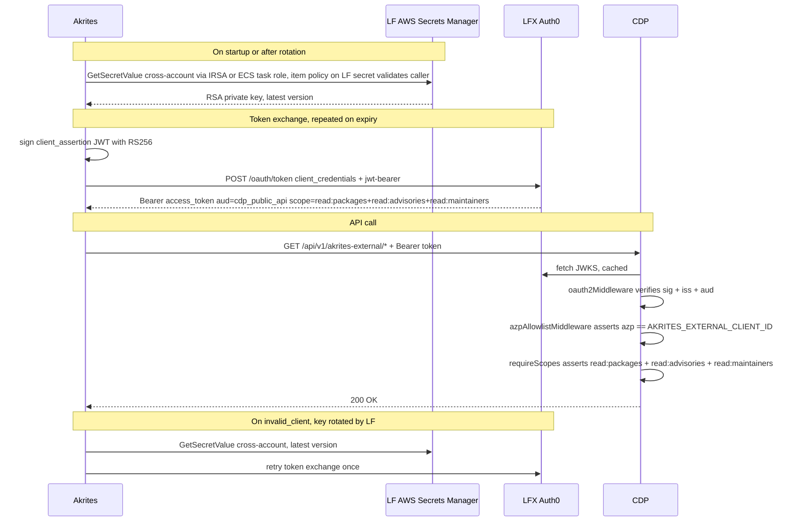

# ADR-0009: Akrites → CDP public API authentication

**Date**: 2026-07-21
**Status**: proposed
**Deciders**: CDP team, LF Auth, Akrites team

## Context

Akrites is a new external consumer that needs read-only access to CDP's public
API through a new route, `/akrites-external`. The route runs on the existing
CDP public API listener (`v1Router`, `backend/src/api/public/v1/index.ts`) —
same service, same process as `/members`, `/organizations`, `/akrites`, etc.

Auth is M2M with an RSA keypair: Akrites signs a JWT `client_assertion`,
exchanges it at LFX Auth0 for a short-lived Bearer token, then calls CDP.
`lfx-secrets-management` owns rotation and distributes the credential.

**Where Akrites runs is not yet known** — confirmation deferred to the
week of 2026-07-27. Working assumption pending that confirmation: Akrites
has an AWS account and a workload IAM role (ECS task role or EKS pod role
via IRSA). The RSA private key sits in an **LF-owned** AWS Secrets Manager
entry. A resource policy on the secret grants `secretsmanager:GetSecretValue`
to Akrites' workload role ARN. Akrites' app makes a direct cross-account
call (same pattern as cross-account S3), validated by the item policy on
LF's secret. LF rotates the keypair inside LF's AWS boundary; how Akrites
picks up a rotated value depends on which delivery pattern is chosen (see
the Akrites section below).

> **KMS note (to validate with LF DevOps):** cross-account Secrets Manager
> reads are commonly documented as requiring a customer-managed KMS key —
> the AWS-managed `aws/secretsmanager` key policy can't be modified to
> grant `kms:Decrypt` to an external principal. If that is accurate for
> LF's current SM setup, the LF secret must be created against a CMK and
> the KMS key policy must also grant `kms:Decrypt` to Akrites' workload
> role. LF DevOps should confirm the encryption mode used by existing
> cross-account CDP secrets and whether a CMK+key-policy step is needed
> here.

Role trust on the Akrites side (who can assume the workload role, whether
Akrites users can also assume it to fetch the secret manually) is Akrites'
concern — LF only cares about the identity of the caller reaching the item
policy.

If confirmation reveals Akrites has no AWS account (or no workload role
for LF to grant access to), we can fall back to the shared `client_secret`
variant (see Alternatives Considered) — everything else in this ADR is
unaffected.

Both `/akrites` (existing, called by LFX Self Serve) and the new
`/akrites-external` share the CDP public API's single audience
(`https://cm.lfx.dev/api/` in prod, `https://lf-staging.crowd.dev/api/` in
dev + staging) via the shared `AUTH0_CONFIG` used by every public route —
`oauth2Middleware` verifies exactly one audience. What differentiates the
two routes is the route-level middleware chain applied on top:
`/akrites-external` adds an `azp` allowlist and a stricter scope set
(`read:packages`, `read:advisories`, `read:maintainers`). Consumers of
`/akrites` continue to hit it with whatever LFX-issued token satisfies the
same CDP audience — no change to that route.

Consumer isolation on `/akrites-external` is enforced by an explicit `azp`
allowlist middleware — that is the sole gate distinguishing Akrites from
other CDP consumers. Data-domain access is gated separately by three
scopes (`read:packages`, `read:advisories`, `read:maintainers`), which
also constrain which handlers the token may reach. Auth0 client IDs are
referenced as `{{AKRITES_AUTH0_CLIENT_ID}}` /
`{{AKRITES_AUTH0_CLIENT_ID_STAGING}}` pending client provisioning.

## Decision

Authenticate Akrites against the **existing `cdp_public_api` resource
server**, gated by an **`azp` allowlist middleware** in CDP (sole consumer
identity gate) and domain scopes **`read:packages`**, **`read:advisories`**,
**`read:maintainers`** on the granted token. Distribute the RSA private
key via an **LF-owned AWS Secrets Manager entry** with a **resource policy
on the secret** granting `GetSecretValue` to Akrites' workload IAM role.
If the secret is encrypted with a customer-managed KMS key (likely
required for cross-account decrypt — LF DevOps to confirm), the KMS key
policy must also grant `kms:Decrypt` to that role. Akrites reads
cross-account, same pattern as cross-account S3. Assumes Akrites has an
AWS account and a workload role — pending confirmation (see Context).

## Auth Flow



## Affected Repositories

### `auth0-terraform`

Three edits, all against the existing `cdp_public_api` resource server. No new
resource server.

**`resource_servers.tf`** — append two new scopes inside
`auth0_resource_server_scopes.cdp_public_api` (`read:packages` already
exists on the resource server and is reused):
```hcl
scopes {
  name        = "read:advisories"
  description = "Read security advisories"
}
scopes {
  name        = "read:maintainers"
  description = "Read package maintainer data"
}
```

**`clients_m2m.tf`** — add one entry to `local.m2m_clients`:
```hcl
"Akrites External" = {
  oidc_conformant = true
}
```
The existing `auth0_client.m2m_clients` `for_each` resource instantiates the
client with `grant_types = ["client_credentials"]`. Auth method starts as
`client_secret_post`; `lfx-secrets-management` rotation converts it to
`private_key_jwt` — same path used for every other CDP M2M client.

**`grants_cdp.tf`** — add the grant next to `lfxone_cdp` and
`persona_service_cdp`:
```hcl
resource "auth0_client_grant" "akrites_external_cdp" {
  client_id = auth0_client.m2m_clients["Akrites External"].id
  audience  = auth0_resource_server.cdp_public_api.identifier
  scopes = [
    "read:packages",
    "read:advisories",
    "read:maintainers",
  ]

  depends_on = [auth0_resource_server_scopes.cdp_public_api]
}
```

Note: `read:packages` is already granted to `lfxone_cdp`. Scope alone does
not identify the Akrites consumer — `azp` allowlist on the CDP side does.

---

### `lfx-secrets-management`

Add a new entry in `secrets/lfx/auth0_clients.yml` for the Akrites External
client. Pattern mirrors every other rotating `auth0_jwt` M2M client:

- **Source**: `auth0_jwt` with `client_name: Akrites External`
- **Destinations**:
  - 1Password (all envs) — safe default, gives operators a browsable copy
  - AWS Secrets Manager in the **LF account** — same SM account as every
    other CDP M2M credential; path `auth0/Akrites_External`. Write is
    same-account for LF.
- **Orchestration**: `secretsmanagement/sync.py` — no code change; the
  existing `auth0_jwt` → destinations pipeline handles it.

**Resource policy on the LF secret** — grants Akrites' workload IAM role
`secretsmanager:GetSecretValue` + `secretsmanager:DescribeSecret`. Deny
wildcards. Akrites' AWS account ID + workload role ARN required from the
Akrites team before the resource policy can be written.

**Encryption (to validate with LF DevOps)** — AWS documentation indicates
that cross-account Secrets Manager reads require the secret to be
encrypted with a customer-managed KMS key; the default
`aws/secretsmanager` key policy is AWS-owned and cannot grant `kms:Decrypt`
to external principals. Before writing the resource policy, LF DevOps
should confirm which encryption mode existing cross-account CDP secrets
use. If a CMK is needed, the KMS key policy must also grant `kms:Decrypt`
to Akrites' workload role.

Role trust on Akrites' side (who can assume the workload role) is Akrites'
concern; LF configures only the item policy on the LF secret.

CDP holds no private key. Token verification is JWKS-only.

---

### `crowd.dev` (CDP — this repo)

The audience for `/akrites-external` is the existing CDP audience — same
`AUTH0_CONFIG` already used by every other public route. No new
`Auth0Configuration` block is needed.

**`backend/config/custom-environment-variables.json`**

Add one env var under the existing block:
```json
"akritesExternal": {
  "clientId": "CROWD_AKRITES_EXTERNAL_CLIENT_ID"
}
```

**`backend/src/conf/index.ts`**

Add:
```ts
export const AKRITES_EXTERNAL_CLIENT_ID: string = config.get<string>('akritesExternal.clientId')
```

**`backend/src/security/scopes.ts`**

Add to the `SCOPES` const (only the two new ones — `READ_PACKAGES` already
exists):
```ts
READ_ADVISORIES: 'read:advisories',
READ_MAINTAINERS: 'read:maintainers',
```

**`backend/src/api/public/middlewares/azpAllowlistMiddleware.ts`** _(new file)_

Reads `req.auth.payload.azp`. Throws `UnauthorizedError` if the value is
missing or not in the allowlist passed at wire-up. Fails closed.

**`backend/src/api/public/v1/index.ts`** — insert a **new** route
registration after the existing `/akrites` mount (line 44) and before the
404 catch-all at line 46:
```ts
router.use(
  '/akrites-external',
  oauth2Middleware(AUTH0_CONFIG),
  azpAllowlistMiddleware([AKRITES_EXTERNAL_CLIENT_ID]),
  requireScopes(
    [SCOPES.READ_PACKAGES, SCOPES.READ_ADVISORIES, SCOPES.READ_MAINTAINERS],
    'all',
  ),
  akritesExternalRouter(),
)
```

`akritesExternalRouter()` is a **new module** at
`backend/src/api/public/v1/akrites-external/index.ts` — separate from the
existing `akritesRouter` and free of its inner scope guards, so the
mount-level `requireScopes` above is authoritative for this route.

`/akrites` (Self Serve) is untouched.

---

### Akrites (external repo)

Implement the token exchange described in the Auth Flow diagram:

1. Fetch the RSA private key from LF's AWS Secrets Manager entry
   (cross-account read). Akrites' workload IAM role's identity policy must
   allow `secretsmanager:GetSecretValue` on the full LF secret ARN. If
   LF confirms the secret is encrypted with a customer-managed KMS key
   (see the Context KMS note), also allow `kms:Decrypt` on that KMS key
   ARN. Choose one of the delivery patterns Eric outlined; each has a
   different rotation behavior:
   - **ECS `ValueFrom`** on the task definition, referencing the LF
     secret ARN. The secret is injected as an environment variable at
     task start only — ECS does not refresh `ValueFrom` values while the
     task is running. Rotation therefore requires task replacement; the
     step-5 retry-once flow means restarting the task, not an in-process
     re-read.
   - **EKS External Secrets Operator + IRSA**, with the operator
     configured to re-sync the secret on a short refresh interval so
     pods pick up the rotated value shortly after LF rotates. In-process
     retry is still possible if the operator has already refreshed.
   - **Direct SDK read** using the workload role — process reads the
     secret via `GetSecretValue` at boot and again on demand for the
     step-5 retry. Simplest match for the retry-once flow without
     touching the task/pod lifecycle.

   Dev: 1Password via the LF-provided vault item.
2. Build and sign a `client_assertion` JWT with `alg: RS256` and header
   `kid` set to the current key's ID. Claims: `iss` = `sub` =
   Akrites client ID, `aud` = LFX Auth0 tenant token endpoint URL, short
   `exp` (≤ 5 min), unique `jti`.
3. POST to Auth0 `/oauth/token` as `application/x-www-form-urlencoded`
   with:
   - `grant_type=client_credentials`
   - `client_id=<AKRITES_EXTERNAL_CLIENT_ID>`
   - `audience=<cdp_public_api identifier>` — `https://cm.lfx.dev/api/`
     in prod, `https://lf-staging.crowd.dev/api/` in dev + staging
   - `client_assertion_type=urn:ietf:params:oauth:client-assertion-type:jwt-bearer`
   - `client_assertion=<signed JWT from step 2>`

   Cache the returned Bearer token until close to expiry (leave a
   clock-skew margin, e.g. refresh at `exp - 60s`).
4. Attach Bearer token to every `/api/v1/akrites-external/*` request as
   `Authorization: Bearer <token>`.
5. On `invalid_client`: discard the cached key → re-fetch from the secret
   store (SDK read, or task/pod refresh depending on the pattern chosen
   in step 1) → retry the token exchange once. LF rotates the keypair
   without notice.

## Alternatives Considered

### Client secret instead of RSA private_key_jwt (fallback)

Use the OAuth2 client credentials flow with a shared `client_secret`, the
same shape as the current `/akrites` (Self Serve) route today, instead of
the RSA-keypair-signed `client_assertion` flow.

- **Pros**: No dependency on an Akrites AWS account, IAM role, or any
  workload identity system on their side. Nothing to fetch from a secret
  store at runtime — the secret is delivered once (out-of-band via a
  1Password share or equivalent) and lives in Akrites' own env config.
  Token exchange is a plain `POST /oauth/token` with `client_id` +
  `client_secret` form fields — no JWT signing, no RSA library, no vault
  library. Fastest path to ship.
- **Cons**: Shared-secret model — both sides hold a copy of the same
  credential. Rotation requires coordinated hand-off (LF rotates, delivers
  new secret out-of-band, Akrites updates env and redeploys). No automated
  re-fetch on rotation, so a rotation window causes downtime unless
  scheduled with Akrites. Longer blast radius on credential compromise
  compared to the asymmetric-key model where only the public key is shared.
  Diverges from the LF convention of `private_key_jwt` for M2M clients.
- **Why not (as default)**: Every other LF-managed CDP M2M client is on
  `private_key_jwt` with `lfx-secrets-management` auto-rotation. Sticking
  with that pattern keeps operational load on the LF side and matches
  reviewer expectations.
- **When to fall back**: If confirmation reveals Akrites has no AWS
  account, or has one but no workload IAM role for LF to grant access to
  via the item policy. The blocker is the cross-account read path, not
  consumption — Akrites can always hold a static `client_secret` in their
  own config.

Delta to the ADR body if this fallback is selected:

- **`auth0-terraform`** — no change to the client, scope, or grant. The
  `Akrites External` client stays on the default `client_secret_post`
  auth method (which is what a fresh client uses before
  `lfx-secrets-management` rotates it to `private_key_jwt`). Drop the
  rotation-to-JWT step for this client.
- **`lfx-secrets-management`** — flip the sync entry source from
  `auth0_jwt` to `auth0` (pattern: `Reimbursement Service client secret`).
  Destination is 1Password only. Drop `auto_rotate: true` — rotation for
  this client becomes manual, coordinated with the Akrites team, and
  performed by re-issuing the secret in Auth0 and re-delivering it.
- **`crowd.dev`** — no change. CDP receives an identical Bearer JWT
  regardless of how Akrites authed to Auth0. The oauth2 / azp / scope
  middleware chain, config, and env vars stay the same.
- **Akrites side** — drop the RSA signing, JWKS setup, and cross-account
  IAM entirely. Store `client_id` + `client_secret` in their own
  environment secret store. On `invalid_client`, pause and coordinate with
  LF rather than auto-retry; do not tight-loop.
