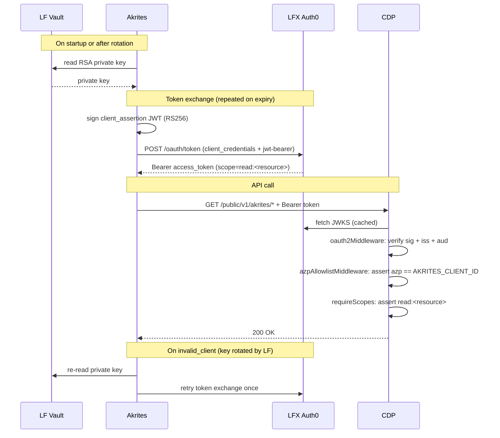

# ADR-0009: Akrites → CDP public API authentication

**Date**: 2026-07-15
**Status**: proposed
**Deciders**: CDP team, LF Auth, Akrites team

## Context

Akrites is a new upstream consumer that needs read-only access to CDP's public
API. LF Auth provisions LF-managed M2M credentials using RSA keypair
authentication: Akrites signs a JWT `client_assertion` with a vault-resident
private key, exchanges it at LFX Auth0 for a short-lived Bearer token, then
calls CDP. CDP verifies the token, enforces a single-consumer restriction, and
gates endpoints on a dedicated scope.

The Auth0 audience (resource-server identifier) is not yet finalized — it is
referenced throughout as `{{AKRITES_CDP_AUDIENCE}}`.

High-level overview: https://linuxfoundation-dxwx.dsp.so/fkNtkFCx-akrites-cdp-auth

## Decision

Authenticate Akrites via **LFX Auth0 with a dedicated resource server and
required scopes**. On the CDP side, add an `azp` allowlist middleware
after JWT verification that asserts the token was issued specifically to
`{{AKRITES_AUTH0_CLIENT_ID}}`, so no other M2M client granted the same
audience can reach the `/akrites` router.

## Auth Flow



## Affected Repositories

### `auth0-terraform`

Three changes. The existing `auth0_resource_server.cdp_public_api` (lines 400–494
of `resource_servers.tf`) and `grants_cdp.tf` are the direct reference — Akrites
gets its own isolated resource server, not a grant on the shared CDP one.

**`resource_servers.tf`** — add these two blocks:
```hcl
resource "auth0_resource_server" "cdp_akrites_api" {
  name = "CDP Akrites API"
  identifier = {
    "dev"     = "{{AKRITES_CDP_AUDIENCE_DEV}}"
    "staging" = "{{AKRITES_CDP_AUDIENCE_STAGING}}"
    "prod"    = "{{AKRITES_CDP_AUDIENCE_PROD}}"
  }[terraform.workspace]

  signing_alg = "RS256"
  token_lifetime = {
    "dev"     = 3600
    "staging" = 10800
    "prod"    = 10800
  }[terraform.workspace]
  token_dialect        = "access_token"
  allow_offline_access = false

  subject_type_authorization {
    user   { policy = "deny_all" }
    client { policy = "require_client_grant" }
  }
}

resource "auth0_resource_server_scopes" "cdp_akrites_api" {
  resource_server_identifier = auth0_resource_server.cdp_akrites_api.identifier

  scopes {
    name        = "read:<resource>"
    description = "Read-only access to CDP data via the Akrites API"
  }
}
```

**`clients_m2m.tf`** — add one entry to `local.m2m_clients` (line ~10):
```hcl
"Akrites" = { oidc_conformant = true },
```
The existing `auth0_client.m2m_clients` `for_each` resource instantiates it
automatically with `grant_types = ["client_credentials"]`. Auth method starts
as `client_secret_post`; `lfx-secrets-management` rotation converts it to
Private Key JWT — same as all other M2M clients.

**`grants_akrites.tf`** _(new file)_
```hcl
resource "auth0_client_grant" "akrites_cdp" {
  client_id  = auth0_client.m2m_clients["Akrites"].id
  audience   = auth0_resource_server.cdp_akrites_api.identifier
  scopes     = ["read:<resource>"]
  depends_on = [auth0_resource_server_scopes.cdp_akrites_api]
}
```

---

### `lfx-secrets-management`

No structural changes. Add Akrites as a new entry in the sync config:

- **Source**: Auth0 — uses existing `Auth0JWTConfig` model
  (`secretsmanagement/services/auth0.py`)
- **Destinations**:
  - AWS Secrets Manager (prod) — `secretsmanagement/services/aws.py` via `boto3`
  - 1Password (dev) — `secretsmanagement/services/onepassword.py` via `op` CLI
- **Orchestration**: `secretsmanagement/sync.py` lines 37–96 — Akrites follows
  same source → destination pattern as all other M2M clients

CDP holds no private key. Token verification is JWKS-only.

---

### `crowd.dev` (CDP — this repo)

**`backend/config/custom-environment-variables.json`** (currently lines 161–166)

Add alongside the existing `auth0` block:
```json
"auth0Akrites": {
  "issuerBaseURLs": "CROWD_AUTH0_AKRITES_ISSUER_BASE_URLS",
  "audience":       "CROWD_AUTH0_AKRITES_AUDIENCE",
  "clientId":       "CROWD_AUTH0_AKRITES_CLIENT_ID"
}
```

**`backend/src/conf/index.ts`** (line 106)

Add:
```ts
export const AKRITES_AUTH0_CONFIG: Auth0Configuration = config.get<Auth0Configuration>('auth0Akrites')
```
`Auth0Configuration` interface (`backend/src/conf/configTypes.ts` lines 68–73) is reused as-is.

**`backend/src/security/scopes.ts`**

Add to `SCOPES` const:
```ts
READ_RESOURCE: 'read:<resource>',
```

**`backend/src/api/public/middlewares/azpAllowlistMiddleware.ts`** _(new file)_

Reads `req.auth.payload.azp`. Throws `UnauthorizedError` if not in the
configured allowlist. Fails closed — any unknown client ID is rejected even if
Auth0 is misconfigured to grant it the same audience.

**`backend/src/api/public/v1/index.ts`** (line 44)

Replace:
```ts
router.use('/akrites', oauth2Middleware(AUTH0_CONFIG), akritesRouter())
```
With:
```ts
router.use(
  '/akrites',
  oauth2Middleware(AKRITES_AUTH0_CONFIG),
  azpAllowlistMiddleware([AKRITES_AUTH0_CONFIG.clientId]),
  requireScopes([SCOPES.READ_AKRITES], 'all'),
  akritesRouter(),
)
```

---

### Akrites (external repo)

Implement the token exchange described in the Auth Flow diagram above:

1. Read RSA private key from vault (AWS Secrets Manager in prod via
   `lfx-secrets-management`, 1Password in dev).
2. Build and sign `client_assertion` JWT (RS256).
3. POST to Auth0 `/oauth/token` — cache the returned Bearer token until it
   expires.
4. Attach Bearer token to all CDP requests via `Authorization` header.
5. On `invalid_client`: discard cached key → re-read from vault → retry token
   exchange once. LF rotates the keypair without notice.
