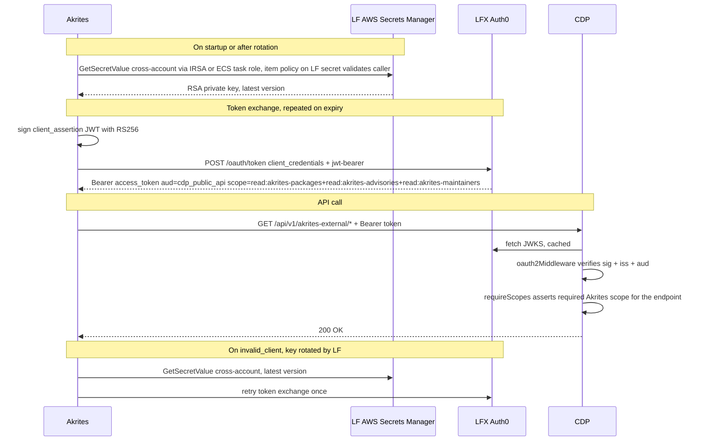

# ADR-0010: Akrites → CDP public API authentication

**Date**: 2026-07-22
**Status**: proposed
**Deciders**: CDP team, LF Auth, Akrites team

## Context

Akrites is a new external consumer that needs read-only access to CDP's public
API through a new route. The route runs on the existing CDP public API listener
(`v1Router`, `backend/src/api/public/v1/index.ts`) — same service, same
process as `/members`, `/organizations`, `/akrites`, etc.

Auth is M2M with an RSA keypair: Akrites signs a JWT `client_assertion`,
exchanges it at LFX Auth0 for a short-lived Bearer token, then calls CDP.
`lfx-secrets-management` owns rotation and distributes the credential.

**Where Akrites runs is not yet known** — confirmation deferred to the
week of 2026-07-27. Working assumption pending that confirmation: Akrites
has an AWS account and a workload IAM role (ECS task role or EKS pod role
via IRSA). The RSA private key sits in an **LF-owned** AWS Secrets Manager
entry. A resource policy on the secret grants `secretsmanager:GetSecretValue`
to Akrites' workload role ARN. Akrites' app makes a direct cross-account
call (same pattern as cross-account S3), validated by the item policy on
LF's secret. LF rotates the keypair inside LF's AWS boundary; how Akrites
picks up a rotated value depends on which delivery pattern is chosen (see
the Akrites section below).

> **KMS note (to validate with LF DevOps):** cross-account Secrets Manager
> reads are commonly documented as requiring a customer-managed KMS key —
> the AWS-managed `aws/secretsmanager` key policy can't be modified to
> grant `kms:Decrypt` to an external principal. If that is accurate for
> LF's current SM setup, the LF secret must be created against a CMK and
> the KMS key policy must also grant `kms:Decrypt` to Akrites' workload
> role. LF DevOps should confirm the encryption mode used by existing
> cross-account CDP secrets and whether a CMK+key-policy step is needed
> here.

Role trust on the Akrites side (who can assume the workload role, whether
Akrites users can also assume it to fetch the secret manually) is Akrites'
concern — LF only cares about the identity of the caller reaching the item
policy.

If confirmation reveals Akrites has no AWS account (or no workload role
for LF to grant access to), we can fall back to the shared `client_secret`
variant (see Alternatives Considered) — everything else in this ADR is
unaffected.

Both `/akrites` (existing, called by LFX Self Serve) and the new
`/akrites-external` route share the CDP public API's single audience
(`https://cm.lfx.dev/api/` in prod, `https://lf-staging.crowd.dev/api/` in
dev + staging) via the shared `AUTH0_CONFIG` used by every public route —
`oauth2Middleware` verifies exactly one audience. What differentiates the
two routes is the route-level middleware chain and the set of scopes
required: `/akrites-external` requires Akrites-namespaced scopes
(`read:akrites-packages`, `read:akrites-advisories`,
`read:akrites-maintainers`) via per-endpoint `requireScopes`. Consumers of
`/akrites` continue to use it with LFX-internal scopes (`read:packages`,
`read:stewardships`, etc.) — no change to that route.

Consumer isolation is claim-based via Auth0 grants. Three Akrites-namespaced
scopes (`read:akrites-packages`, `read:akrites-advisories`,
`read:akrites-maintainers`) are defined on `cdp_public_api` and granted only
to the `Akrites Enclave` client. Auth0 will not issue these scopes to any
other client, so tokens from other CDP consumers (e.g. `lfx_one` for LFX
Self Serve) cannot carry them. CDP's per-endpoint `requireScopes` middleware
is the sole enforcement point at the API layer — no `azp` allowlist or other
client-identity inspection in CDP source.

CDP does not validate client_id or client_secret. It only sees the
Auth0-signed bearer token. Both `lfx_one` (`client_secret_post`) and
`Akrites Enclave` (`private_key_jwt`) obtain tokens against the same
`cdp_public_api` audience; from CDP's perspective the tokens are
shape-identical. The `private_key_jwt` vs `client_secret_post` distinction
lives entirely between client and Auth0.

## Decision

Authenticate the `Akrites Enclave` client against the **existing
`cdp_public_api` resource server**, gated by three Akrites-namespaced scopes
(`read:akrites-packages`, `read:akrites-advisories`,
`read:akrites-maintainers`) granted only to this client on `cdp_public_api`.
CDP enforces via per-endpoint `requireScopes`; no consumer-identity check
outside the scope claim. Distribute the RSA private key via an **LF-owned
AWS Secrets Manager entry** with a **resource policy on the secret** granting
`GetSecretValue` to Akrites' workload IAM role. If the secret is encrypted
with a customer-managed KMS key (likely required for cross-account decrypt —
LF DevOps to confirm), the KMS key policy must also grant `kms:Decrypt` to
that role. Akrites reads cross-account, same pattern as cross-account S3.
Assumes Akrites has an AWS account and a workload role — pending confirmation
(see Context).

## Auth Flow



## Affected Repositories

### `auth0-terraform`

Three edits, all against the existing `cdp_public_api` resource server. No new
resource server.

**`resource_servers.tf`** — replace the two scopes added in this branch with
three Akrites-namespaced ones inside `auth0_resource_server_scopes.cdp_public_api`:
```hcl
scopes {
  name        = "read:akrites-packages"
  description = "Read package data via the Akrites Enclave surface"
}
scopes {
  name        = "read:akrites-advisories"
  description = "Read security advisories via the Akrites Enclave surface"
}
scopes {
  name        = "read:akrites-maintainers"
  description = "Read package maintainer data via the Akrites Enclave surface"
}
```

**`clients_m2m.tf`** — add one entry to `local.m2m_clients`:
```hcl
"Akrites Enclave" = { # Client for Akrites to consume the CDP public API
  oidc_conformant = true
}
```
The existing `auth0_client.m2m_clients` `for_each` resource instantiates the
client with `grant_types = ["client_credentials"]`. Auth method starts as
`client_secret_post`; `lfx-secrets-management` rotation converts it to
`private_key_jwt` — same path used for every other CDP M2M client.

**`grants_cdp.tf`** — add the grant next to `lfxone_cdp` and
`persona_service_cdp`:
```hcl
# Akrites Enclave CDP grant. Consumer isolation is claim-based: the three
# `read:akrites-*` scopes below are granted only to this client on
# cdp_public_api. Auth0 refuses to issue these scopes to any other client,
# so tokens from other CDP consumers (e.g. lfx_one) cannot carry them, and
# CDP's per-endpoint requireScopes middleware blocks any request without
# them. To add another external consumer of the Akrites-shaped surface,
# add a new grant here with its own scopes; to open a scope to another
# consumer, add it to that consumer's grant here — the governance surface
# is this file.
#
# Client credential is rotated from client_secret_post to private_key_jwt
# by lfx-secrets-management (same path used by other CDP M2M clients).
resource "auth0_client_grant" "akrites_enclave_cdp" {
  client_id = auth0_client.m2m_clients["Akrites Enclave"].id
  audience  = auth0_resource_server.cdp_public_api.identifier
  scopes = [
    "read:akrites-packages",
    "read:akrites-advisories",
    "read:akrites-maintainers",
  ]

  depends_on = [auth0_resource_server_scopes.cdp_public_api]
}
```

---

### `lfx-secrets-management`

Add a new entry in `secrets/lfx/auth0_clients.yml` for the Akrites Enclave
client. Pattern mirrors every other rotating `auth0_jwt` M2M client:

- **Source**: `auth0_jwt` with `client_name: Akrites Enclave`
- **Destinations**:
  - 1Password (all envs) — safe default, gives operators a browsable copy
  - AWS Secrets Manager in the **LF account** — same SM account as every
    other CDP M2M credential; path `auth0/Akrites_Enclave`. Write is
    same-account for LF.
- **Orchestration**: `secretsmanagement/sync.py` — no code change; the
  existing `auth0_jwt` → destinations pipeline handles it.

**Resource policy on the LF secret** — grants Akrites' workload IAM role
`secretsmanager:GetSecretValue` + `secretsmanager:DescribeSecret`. Deny
wildcards. Akrites' AWS account ID + workload role ARN required from the
Akrites team before the resource policy can be written.

**Encryption (to validate with LF DevOps)** — AWS documentation indicates
that cross-account Secrets Manager reads require the secret to be
encrypted with a customer-managed KMS key; the default
`aws/secretsmanager` key policy is AWS-owned and cannot grant `kms:Decrypt`
to external principals. Before writing the resource policy, LF DevOps
should confirm which encryption mode existing cross-account CDP secrets
use. If a CMK is needed, the KMS key policy must also grant `kms:Decrypt`
to Akrites' workload role.

Role trust on Akrites' side (who can assume the workload role) is Akrites'
concern; LF configures only the item policy on the LF secret.

CDP holds no private key. Token verification is JWKS-only.

---

### `crowd.dev` (CDP — this repo)

The audience for the Akrites Enclave route is the existing CDP audience —
same `AUTH0_CONFIG` already used by every other public route. No new
`Auth0Configuration` block is needed.

**`backend/src/security/scopes.ts`**

Add three new consts (only these three are new — existing scopes are
unchanged):
```ts
READ_AKRITES_PACKAGES: 'read:akrites-packages',
READ_AKRITES_ADVISORIES: 'read:akrites-advisories',
READ_AKRITES_MAINTAINERS: 'read:akrites-maintainers',
```

**`backend/src/api/public/v1/index.ts`** — mount at the existing position:
```ts
router.use('/akrites-external', oauth2Middleware(AUTH0_CONFIG), akritesExternalRouter())
```

No mount-level `requireScopes` — scope checks are per-subrouter inside
`akritesExternalRouter()`, same pattern as `akritesRouter()`.

**`backend/src/api/public/v1/akrites-external/index.ts`** — replace the
placeholder scope constants (current TODO comments call this out explicitly)
with the newly-provisioned Akrites-namespaced scopes:

```ts
// packages subrouter
packagesSubRouter.use(requireScopes([SCOPES.READ_AKRITES_PACKAGES]))

// advisories subrouter
advisoriesSubRouter.use(requireScopes([SCOPES.READ_AKRITES_ADVISORIES]))

// contacts subrouter
contactsSubRouter.use(requireScopes([SCOPES.READ_AKRITES_MAINTAINERS]))

// blast-radius subrouter (same surface as advisories per the contract)
blastRadiusSubRouter.use(requireScopes([SCOPES.READ_AKRITES_ADVISORIES]))
```

Remove the TODO comments once the scopes are provisioned — the swap is
complete.

`/akrites` (Self Serve) is untouched.

---

### Akrites (external repo)

High-level responsibilities only. Concrete implementation (delivery
pattern, IAM wiring, exact JWT header/claim shape, HTTP form fields) is
deferred until Akrites' AWS setup is confirmed (week of 2026-07-27) and
`lfx-secrets-management` finalizes the secret payload;

1. **Fetch** the credential material from LF's AWS Secrets Manager
   entry cross-account. The delivery pattern (ECS `ValueFrom`, EKS
   External Secrets Operator, direct SDK read) is chosen based on where
   Akrites runs; LF grants the item policy to whichever IAM role
   performs the fetch. Dev environment: 1Password via the LF-provided
   vault item.
2. **Sign a `client_assertion` JWT** with the fetched private key and
   exchange it at LFX Auth0 for a short-lived Bearer token against the
   `cdp_public_api` audience. The SM payload is atomic — it carries the
   private key together with any Auth0-side identifiers (e.g. the
   credential `kid`) LF ships alongside the key. Akrites reads the whole
   payload as one unit and uses everything in it to build the assertion.
3. **Call** `/api/v1/akrites-external/*` with `Authorization: Bearer
   <token>`. Cache the token until close to expiry, refreshing with a
   clock-skew margin.
4. **On `invalid_client`** (LF rotated the keypair without notice):
   discard the cached credential material, re-read from the secret
   store, retry the token exchange once.

## Alternatives Considered

### Client secret instead of RSA private_key_jwt (fallback)

Use the OAuth2 client credentials flow with a shared `client_secret`, the
same shape as the current `/akrites` (Self Serve) route today, instead of
the RSA-keypair-signed `client_assertion` flow.

- **Pros**: No dependency on an Akrites AWS account, IAM role, or any
  workload identity system on their side. Nothing to fetch from a secret
  store at runtime — the secret is delivered once (out-of-band via a
  1Password share or equivalent) and lives in Akrites' own env config.
  Token exchange is a plain `POST /oauth/token` with `client_id` +
  `client_secret` form fields — no JWT signing, no RSA library, no vault
  library. Fastest path to ship.
- **Cons**: Shared-secret model — both sides hold a copy of the same
  credential. Rotation requires coordinated hand-off (LF rotates, delivers
  new secret out-of-band, Akrites updates env and redeploys). No automated
  re-fetch on rotation, so a rotation window causes downtime unless
  scheduled with Akrites. Longer blast radius on credential compromise
  compared to the asymmetric-key model where only the public key is shared.
  Diverges from the LF convention of `private_key_jwt` for M2M clients.
- **Why not (as default)**: Every other LF-managed CDP M2M client is on
  `private_key_jwt` with `lfx-secrets-management` auto-rotation. Sticking
  with that pattern keeps operational load on the LF side and matches
  reviewer expectations.
- **When to fall back**: If confirmation reveals Akrites has no AWS
  account, or has one but no workload IAM role for LF to grant access to
  via the item policy. The blocker is the cross-account read path, not
  consumption — Akrites can always hold a static `client_secret` in their
  own config.

Delta to the ADR body if this fallback is selected:

- **`auth0-terraform`** — no change to the client, scope, or grant. The
  `Akrites Enclave` client stays on the default `client_secret_post`
  auth method (which is what a fresh client uses before
  `lfx-secrets-management` rotates it to `private_key_jwt`). Drop the
  rotation-to-JWT step for this client.
- **`lfx-secrets-management`** — flip the sync entry source from
  `auth0_jwt` to `auth0` (pattern: `Reimbursement Service client secret`).
  Destination is 1Password only. Drop `auto_rotate: true` — rotation for
  this client becomes manual, coordinated with the Akrites team, and
  performed by re-issuing the secret in Auth0 and re-delivering it.
- **`crowd.dev`** — no change. CDP receives an identical Bearer JWT
  regardless of how Akrites authed to Auth0. The oauth2 + requireScopes
  middleware chain stays the same.
- **Akrites side** — drop the RSA signing, JWKS setup, and cross-account
  IAM entirely. Store `client_id` + `client_secret` in their own
  environment secret store. On `invalid_client`, pause and coordinate with
  LF rather than auto-retry; do not tight-loop.

### `azp` allowlist middleware for consumer identity (superseded)

Earlier revisions of this ADR gated the Akrites Enclave route with an
`azpAllowlistMiddleware` reading `req.auth.payload.azp` against the Akrites
client ID from env. Consumer identity lived in CDP source code (a client-ID
allowlist), independent of Auth0's grant model.

- **Pros**: consumer gate does not depend on how scopes are named or
  granted; a single generic scope set could be shared across consumers.
- **Cons**: resource server becomes coupled to specific client IDs; every
  new consumer or client-ID rotation is a CDP code + redeploy change;
  identity is invisible to Auth0's governance surface (grants, resource-
  server scope model). Diverges from the rest of the CDP public API, which
  already gates on scopes via `requireScopes` (e.g.
  `/packages:batch-stewardship`).
- **Why superseded**: reviewer feedback on the `auth0-terraform` PR
  (@detjensrobert, 2026-07-21) — trust decisions on resource servers
  should be claim-based, not caller-metadata based. Namespaced
  Akrites-only scopes put the identity gate inside Auth0's grant model and
  let CDP stay pure-claims via the existing `requireScopes` middleware.
