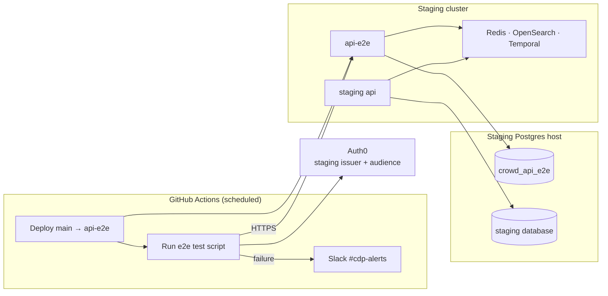

# ADR-0012: API e2e test architecture

**Date**: 2026-07-25
**Status**: accepted
**Deciders**: Yeganathan S

## Context

We want to catch API regressions on main sooner (routing, validation, and the synchronous HTTP response contract with a valid token) instead of waiting for a consumer to hit a problem. Manually running the test script is easy to forget, pollutes staging data, depends on existing fixtures, and is not something we can rely on as a team.

A more complete API e2e harness in the server test setup (PR CI, isolated fixtures, typed assertions) is planned for future work. Until then, we need a simple automated check that runs against an isolated environment and gives us confidence that the deployed API is still working as expected.

The first test suite covers the Public API. These endpoints are the external contract our consumers rely on, so they are the best place to start. We can add more API e2e suites over time using the same runtime and suite pattern as needed.

This ADR covers the runtime and isolation architecture for API e2e tests. The design of the test suites themselves is covered in [ADR-0013](./0013-api-e2e-test-suite-design.md). The current suite lives in [`.github/scripts/public-api-e2e-tests.sh`](../../.github/scripts/public-api-e2e-tests.sh).

## Decision

Run **scheduled API e2e regression tests** (intentionally thin) via GitHub Actions against a dedicated `api-e2e` deployment of `main`, with data in a separate database on the existing staging Postgres host. Coverage starts with **Public API** endpoints; the same approach can extend to internal API e2e tests later if needed.

### Stack

- **`api-e2e`**: normal API deployment of `main` (same image, staging-shaped config). One deliberate difference: `CROWD_DB_DATABASE=crowd_api_e2e`. It shares staging Redis, OpenSearch, and Temporal. The e2e tests do not assert on those systems; cloning them would cost more without improving the HTTP contract signal we care about.
- **`crowd_api_e2e`**: a separate **database name** on the existing staging Postgres host, not a second Postgres server. Same Flyway migrations as staging; no e2e-only schema.
- **Auth0**: LFX One’s staging M2M client (issuer and audience unchanged). Only the API base URL points at `api-e2e`. CI talks to the API over HTTPS only. Secrets stay in GitHub Actions / env: never committed, never logged (`set -x` refused by the script).
- **Scope**: API e2e tests, **Public API first** (external contract). Internal endpoints can get suites later when they need them ([ADR-0013](./0013-api-e2e-test-suite-design.md)).

### What a scheduled run does

1. Deploy `main` to `api-e2e`
2. Authenticate with Auth0
3. Seed fixtures over HTTP (`RUN_ID`-tagged names and domains)
4. Call endpoints and assert status + body
5. Alert `#cdp-alerts` on failure

`RUN_ID` is `GITHUB_RUN_ID` (or a local timestamp) plus a `${RANDOM}` suffix. The suffix matters because workflow reruns reuse the same `GITHUB_RUN_ID`. Fixtures include it so runs do not collide and leftovers stay easy to spot. The suite seeds over HTTP and does not require a wiped database between runs, only a reachable `api-e2e`.

### What we assert (and what we do not)

- **Assert**: routing, validation, sync response shape and critical flows using a valid fully scoped token.
- **Do not assert**: Temporal / OpenSearch eventual outcomes. Some writes await Temporal accepting a signal before the HTTP response returns; async worker work stays out of scope for this suite.

### Not a PR gate

A single shared `api-e2e` cannot safely gate concurrent PRs, because deploys and DB use would step on each other. This stack is a **scheduled check of what `main` deployed**. Per-PR API e2e waits on the backlog harness.

### Database reset (ops)

`reset_api_e2e_test_db.sh` runs on the EC2 host used to reach staging Postgres over SSH. It creates `crowd_api_e2e` if needed, applies normal Flyway migrations, truncates tables, and seeds the default tenant.

Run it after migrations land on `main`, or when leftover e2e test rows should be cleared. Keep that host’s crowd.dev checkout on latest `main` so Flyway matches the deployed `api-e2e`.

Reset stays manual: the e2e database is only reachable through that EC2/SSH path. Wiring wipe/migrate into GitHub Actions would mean exposing DB access there, which is not worth it for an occasional ops step.

## Alternatives Considered

### Alternative 1: Hand-run e2e tests against shared staging

- **Pros**: No new deploy or database.
- **Cons**: Pollutes staging; fragile ambient fixtures; cannot expect everyone to run it.
- **Why not**: Rejected as a team practice.

### Alternative 2: Point shared staging `api` at an e2e database for the run

- **Pros**: No second API deployment.
- **Cons**: Staging users and data path become coupled to test runs; high blast radius.
- **Why not**: Isolation requires a dedicated API process, not only a DB name.

### Alternative 3: Separate Postgres server (or full clone of Redis / OpenSearch / Temporal)

- **Pros**: Stronger isolation.
- **Cons**: More infra and cost; little extra signal for HTTP contract e2e tests.
- **Why not**: A second database name plus shared side deps is enough for this suite.

### Alternative 4: Use shared `api-e2e` as a PR CI gate

- **Pros**: Feedback on the branch.
- **Cons**: Concurrent PRs overwrite deploys and data; flaky and misleading.
- **Why not**: Needs per-PR environments or a different harness. Out of scope until the backlog work lands.

### Alternative 5: Wait for the backlog PR-time API e2e harness before any automation

- **Pros**: One end state only.
- **Cons**: No automated HTTP safety net meanwhile.
- **Why not**: Scheduled API e2e tests are an acceptable bridge.

## Consequences

### Positive

- Catches Public API regressions on `main` sooner, without hand runs or staging DB pollution.
- Clear ownership: runtime here; suite shape in [ADR-0013](./0013-api-e2e-test-suite-design.md); script in `.github/scripts/`.
- Cheap isolation (DB name + small always-on `api-e2e`).
- Public API contract covered first; internal e2e tests can be added later only when needed.

### Negative

- Validates deployed `main`, not unmerged PR branches.
- Soft leftovers in `crowd_api_e2e` until someone runs the reset script.
- Bash e2e tests will not scale forever as a full matrix (by design; keep it thin).

### Risks

- `api-e2e` drifts from staging config → treat it as a clone with only `CROWD_DB_DATABASE` different; deploy `main` on the schedule.
- Flyway on the EC2 checkout lags `main` → reset script refuses to run until the checkout is updated.
- Pressure to assert async side effects → push that to worker/workflow tests; keep this suite on the sync HTTP contract.
- Backlog PR-time API e2e delayed → these scheduled e2e tests remain the safety net; that is acceptable.
- Scope creep into internal APIs before Public coverage is solid → keep Public as the focus unless there is a concrete need.
