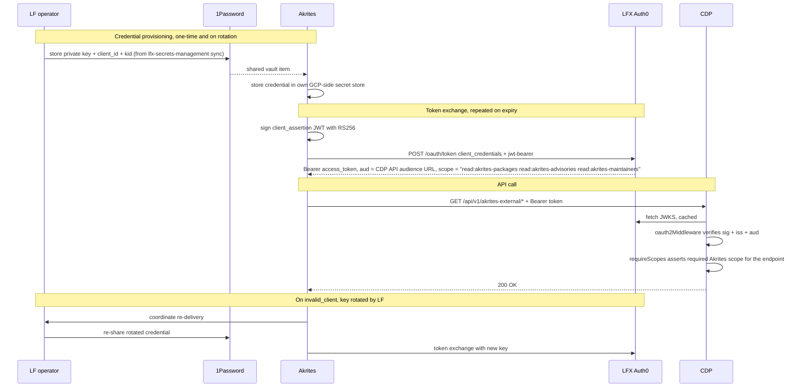

# ADR-0016: Akrites → CDP public API authentication

**Date**: 2026-07-22
**Status**: proposed
**Deciders**: CDP team, LF Auth, Akrites team

## Context

Akrites is a new external consumer that needs read-only access to CDP's public
API through a new route. The route runs on the existing CDP public API listener
(`v1Router`, `backend/src/api/public/v1/index.ts`) — same service, same
process as `/members`, `/organizations`, `/akrites`, etc.

Auth is M2M with an RSA keypair: Akrites signs a JWT `client_assertion`,
exchanges it at LFX Auth0 for a short-lived Bearer token, then calls CDP.
`lfx-secrets-management` owns the credential on the LF side; delivery to
Akrites is via 1Password for now (see below).

**Akrites' service is hosted on GCP** (confirmed with the Akrites team on
2026-07-28). `lfx-secrets-management` delivers credentials to AWS-side
destinations and 1Password today; GCP is not a supported destination, and
adding it is non-trivial (LF has no GCP accounts to test against, and the
auth/service-account setup is undefined). LF CloudOps has taken GCP support
as a backlog item, behind other secret-management automation work
(2026-07-28).

Until GCP support lands, credential delivery is manual: the RSA private
key, `client_id`, and credential `kid` are shared with Akrites via a
**1Password vault item**. Rotation is coordinated between LF and Akrites
rather than automated. The client's auth method is `private_key_jwt`
regardless of how the secret is stored and delivered.

Both `/akrites` (existing, called by LFX Self Serve) and the new
`/akrites-external` route share the CDP public API's single audience
(`https://cm.lfx.dev/api/` in prod, `https://lf-staging.crowd.dev/api/` in
dev + staging) via the shared `AUTH0_CONFIG` used by every public route —
`oauth2Middleware` verifies exactly one audience. What differentiates the
two routes is the route-level middleware chain and the set of scopes
required: `/akrites-external` requires Akrites-namespaced scopes
(`read:akrites-packages`, `read:akrites-advisories`,
`read:akrites-maintainers`) via per-endpoint `requireScopes`. Consumers of
`/akrites` continue to use it with LFX-internal scopes (`read:packages`,
`read:stewardships`, etc.) — no change to that route.

Consumer isolation is claim-based via Auth0 grants. Three Akrites-namespaced
scopes (`read:akrites-packages`, `read:akrites-advisories`,
`read:akrites-maintainers`) are defined on `cdp_public_api` and granted only
to the `Akrites Enclave` client. Auth0 will not issue these scopes to any
other client, so tokens from other CDP consumers (e.g. `lfx_one` for LFX
Self Serve) cannot carry them. CDP's per-endpoint `requireScopes` middleware
is the sole enforcement point at the API layer — no `azp` allowlist or other
client-identity inspection in CDP source.

CDP does not validate client_id or client_secret. It only sees the
Auth0-signed bearer token. Both `lfx_one` (`client_secret_post`) and
`Akrites Enclave` (`private_key_jwt`) obtain tokens against the same
`cdp_public_api` audience; from CDP's perspective the tokens are
shape-identical. The `private_key_jwt` vs `client_secret_post` distinction
lives entirely between client and Auth0.

## Decision

Authenticate the `Akrites Enclave` client against the **existing
`cdp_public_api` resource server**, gated by three Akrites-namespaced scopes
(`read:akrites-packages`, `read:akrites-advisories`,
`read:akrites-maintainers`) granted only to this client on `cdp_public_api`.
CDP enforces via per-endpoint `requireScopes`; no consumer-identity check
outside the scope claim. The client authenticates to Auth0 with
`private_key_jwt`. Distribute the RSA private key, `client_id`, and `kid`
to Akrites via a **1Password vault item** (manual, LF-operated); rotation
is coordinated between LF and Akrites. Automated delivery is deferred until
`lfx-secrets-management` supports GCP as a destination (LF CloudOps backlog
item — Akrites runs on GCP).

## Auth Flow



## Affected Repositories

### `auth0-terraform`

Three additions, all against the existing `cdp_public_api` resource server.
No new resource server.

**`resource_servers.tf`** — three Akrites-namespaced scopes inside
`auth0_resource_server_scopes.cdp_public_api`:
```hcl
scopes {
  name        = "read:akrites-packages"
  description = "Read package data via the Akrites Enclave surface"
}
scopes {
  name        = "read:akrites-advisories"
  description = "Read security advisories via the Akrites Enclave surface"
}
scopes {
  name        = "read:akrites-maintainers"
  description = "Read package maintainer data via the Akrites Enclave surface"
}
```

**`clients_m2m.tf`** — one entry in `local.m2m_clients`:
```hcl
"Akrites Enclave" = { # Client for Akrites to consume the CDP public API
  oidc_conformant = true
}
```
The existing `auth0_client.m2m_clients` `for_each` resource instantiates the
client with `grant_types = ["client_credentials"]`. Auth method starts as
`client_secret_post`; `lfx-secrets-management` rotation converts it to
`private_key_jwt` — same path used for every other CDP M2M client.

**`grants_cdp.tf`** — the grant, next to `lfxone_cdp` and
`persona_service_cdp`:
```hcl
# Akrites Enclave CDP grant. Consumer isolation is claim-based: the three
# `read:akrites-*` scopes below are granted only to this client on
# cdp_public_api. Auth0 refuses to issue these scopes to any other client,
# so tokens from other CDP consumers (e.g. lfx_one) cannot carry them, and
# CDP's per-endpoint requireScopes middleware blocks any request without
# them. To add another external consumer of the Akrites-shaped surface,
# add a new grant here with its own scopes; to open a scope to another
# consumer, add it to that consumer's grant here — the governance surface
# is this file.
#
# Client credential is rotated from client_secret_post to private_key_jwt
# by lfx-secrets-management (same path used by other CDP M2M clients).
resource "auth0_client_grant" "akrites_enclave_cdp" {
  client_id = auth0_client.m2m_clients["Akrites Enclave"].id
  audience  = auth0_resource_server.cdp_public_api.identifier
  scopes = [
    "read:akrites-packages",
    "read:akrites-advisories",
    "read:akrites-maintainers",
  ]

  depends_on = [auth0_resource_server_scopes.cdp_public_api]
}
```

---

### `lfx-secrets-management`

Add a new entry in `secrets/lfx/auth0_clients.yml` for the Akrites Enclave
client. Pattern mirrors every other rotating `auth0_jwt` M2M client:

- **Source**: `auth0_jwt` with `client_name: Akrites Enclave`
- **Destinations**: 1Password only (all envs). Akrites runs on GCP, and
  GCP is not a supported destination today — the 1Password item is the
  hand-off point to the Akrites team.
- **Orchestration**: `secretsmanagement/sync.py` — no code change; the
  existing `auth0_jwt` → destinations pipeline handles it.

**Rotation** — manual and coordinated for this client: LF rotates the
keypair in Auth0, re-delivers via 1Password, and Akrites updates their own
secret store. GCP as a delivery destination is an LF CloudOps backlog item;
once it lands, this sync entry gains the GCP destination and rotation
pickup becomes automated, with no change to the Auth0 client or CDP.

CDP holds no private key. Token verification is JWKS-only.

---

### `crowd.dev` (CDP — this repo)

The audience for the Akrites Enclave route is the existing CDP audience —
same `AUTH0_CONFIG` already used by every other public route. No new
`Auth0Configuration` block is needed.

**`backend/src/security/scopes.ts`**

Three Akrites consts (existing scopes unchanged):
```ts
READ_AKRITES_PACKAGES: 'read:akrites-packages',
READ_AKRITES_ADVISORIES: 'read:akrites-advisories',
READ_AKRITES_MAINTAINERS: 'read:akrites-maintainers',
```

**`backend/src/api/public/v1/index.ts`** — the route is mounted at the
existing position:
```ts
router.use('/akrites-external', oauth2Middleware(AUTH0_CONFIG), akritesExternalRouter())
```

No mount-level `requireScopes` — scope checks are per-subrouter inside
`akritesExternalRouter()`, same pattern as `akritesRouter()`.

**`backend/src/api/public/v1/akrites-external/index.ts`** — each subrouter
gates on its Akrites-namespaced scope:

```ts
// packages subrouter
packagesSubRouter.use(requireScopes([SCOPES.READ_AKRITES_PACKAGES]))

// advisories subrouter
advisoriesSubRouter.use(requireScopes([SCOPES.READ_AKRITES_ADVISORIES]))

// contacts subrouter
contactsSubRouter.use(requireScopes([SCOPES.READ_AKRITES_MAINTAINERS]))

// blast-radius subrouter (same surface as advisories per the contract)
blastRadiusSubRouter.use(requireScopes([SCOPES.READ_AKRITES_ADVISORIES]))
```

**`backend/src/api/public/v1/akrites-external/openapi.yaml`** — advertises
the Akrites-namespaced scopes everywhere scopes appear: global and
operation-level `security` requirements, 403 response descriptions, tags,
and the OAuth2 flow description — the same scopes `requireScopes` enforces.

`/akrites` (Self Serve) is untouched.

---

### Akrites (external repo)

High-level responsibilities only. Concrete implementation (exact JWT
header/claim shape, HTTP form fields, choice of GCP-side secret store) is
Akrites' call.

1. **Receive** the credential material (RSA private key, `client_id`,
   `kid`) from the LF-shared 1Password vault item and store it in their
   own GCP-side secret store (e.g. GCP Secret Manager). The 1Password
   payload is atomic — Akrites uses everything in it to build the
   assertion.
2. **Sign a `client_assertion` JWT** with the private key and exchange
   it at LFX Auth0 for a short-lived Bearer token against the
   `cdp_public_api` audience.
3. **Call** `/api/v1/akrites-external/*` with `Authorization: Bearer
   <token>`. Cache the token until close to expiry, refreshing with a
   clock-skew margin.
4. **On `invalid_client`** (keypair rotated): coordinate with LF for
   re-delivery of the rotated credential via 1Password — do not
   tight-loop the token exchange.

## Alternatives Considered

### Client secret instead of RSA private_key_jwt (not taken)

Use the OAuth2 client credentials flow with a shared `client_secret`, the
same shape as the current `/akrites` (Self Serve) route today, instead of
the RSA-keypair-signed `client_assertion` flow.

- **Pros**: No workload identity or key-signing setup on the Akrites
  side. Token exchange is a plain `POST /oauth/token` with `client_id` +
  `client_secret` form fields — no JWT signing, no RSA library. Fastest
  path to ship.
- **Cons**: Shared-secret model — both sides hold a copy of the same
  credential. Longer blast radius on credential compromise compared to
  the asymmetric-key model where only the public key is shared. Diverges
  from the LF convention of `private_key_jwt` for M2M clients. Since
  delivery is via 1Password either way, it saves nothing operationally —
  rotation hand-off is identical.
- **Why not**: Every other LF-managed CDP M2M client is on
  `private_key_jwt`; LF Auth sets the client up for JWT private key
  assertions regardless of how the secret is stored and delivered
  (2026-07-28). The `private_key_jwt` flow works fine with 1Password
  delivery, so there is no reason to weaken the credential model.

### Cross-account AWS Secrets Manager delivery (not applicable)

Distribute the RSA private key via an LF-owned AWS Secrets Manager entry
with a resource policy granting `secretsmanager:GetSecretValue` to
Akrites' workload IAM role (ECS task role or EKS pod role via IRSA), read
cross-account — the same pattern as cross-account S3. Cross-account reads
would likely also require the secret to be encrypted with a
customer-managed KMS key whose key policy grants `kms:Decrypt` to the
Akrites role.

- **Pros**: Fully automated delivery and rotation pickup — LF rotates
  inside its own AWS boundary and Akrites re-fetches the latest version
  on `invalid_client`, with no manual hand-off or coordination window.
- **Cons**: Requires an Akrites AWS account and workload IAM role, plus
  CMK/key-policy work on the LF side.
- **Why not**: Akrites' service runs on GCP (confirmed 2026-07-28). There
  is no Akrites AWS workload role to grant, and `lfx-secrets-management`
  has no GCP delivery path today — GCP support is an LF CloudOps backlog
  item. When it lands, delivery moves from 1Password to an automated
  GCP-side destination with no change to the Auth0 client or CDP.

### `azp` allowlist middleware for consumer identity (superseded)

Earlier revisions of this ADR gated the Akrites Enclave route with an
`azpAllowlistMiddleware` reading `req.auth.payload.azp` against the Akrites
client ID from env. Consumer identity lived in CDP source code (a client-ID
allowlist), independent of Auth0's grant model.

- **Pros**: consumer gate does not depend on how scopes are named or
  granted; a single generic scope set could be shared across consumers.
- **Cons**: resource server becomes coupled to specific client IDs; every
  new consumer or client-ID rotation is a CDP code + redeploy change;
  identity is invisible to Auth0's governance surface (grants, resource-
  server scope model). Diverges from the rest of the CDP public API, which
  already gates on scopes via `requireScopes` (e.g.
  `/packages:batch-stewardship`).
- **Why superseded**: reviewer feedback on the `auth0-terraform` PR
  (@detjensrobert, 2026-07-21) — trust decisions on resource servers
  should be claim-based, not caller-metadata based. Namespaced
  Akrites-only scopes put the identity gate inside Auth0's grant model and
  let CDP stay pure-claims via the existing `requireScopes` middleware.
