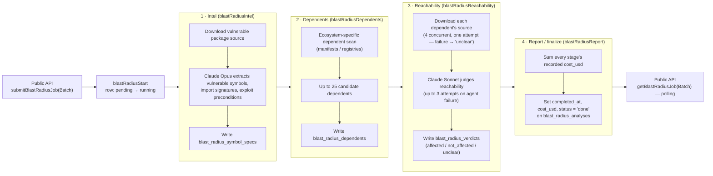

# ADR-0017: Blast radius analysis pipeline — multi-ecosystem architecture

**Date**: 2026-08-11
**Status**: accepted
**Deciders**: Umberto Sgueglia

## Context
Given a security advisory and a vulnerable package/version, "blast radius" answers: which
downstream open-source projects actually pull in the vulnerable code, and is the vulnerable
symbol *reachable* from their code (not just present as a transitive dependency)? Naive
dependency-graph counts overstate exposure — most transitive dependents never call the
vulnerable path. The analysis needs source-level reasoning per dependent, which is expensive
and only tractable with an LLM agent that can read code, not a static graph traversal.

The feature started as npm-only (`feat/add-blast-radius-methodlogy`, CM-1328) and was then
generalized to go, maven, cargo, nuget, rubygems, and pypi one ecosystem at a time
(CM-1358). It is consumed exclusively through a public, asynchronous Public API
(`submitBlastRadiusJob(Batch)` / `getBlastRadiusJob(Batch)` in
`backend/src/api/public/v1/packages/`) in production — there is no CLI or batch-report
consumer of *finished* analyses. The one exception is
`backend/src/bin/scripts/blastRadiusLoadTest.ts`, a dev-only harness that starts
`analyzeBlastRadius` workflows directly through the Temporal client, bypassing the HTTP
layer (and its Zod validation/Auth0) entirely — it exists to load-test the pipeline, not
to consume its output.

## Decision
Implement blast radius as a 4-stage Temporal workflow (`analyzeBlastRadius` in
`services/apps/packages_worker/src/blast-radius/workflows.ts`), with each stage generalized
across ecosystems through a compile-time-checked per-ecosystem config registry, and with
Claude agent calls routed through a shared credential-resolution chain that supports a
developer's personal Claude Code OAuth token for local runs without AWS access.

### The 4 stages

Every arrow below is a hard sequential dependency, not a fan-out: stage *N+1* only
starts once stage *N*'s activity has returned successfully (`workflows.ts` simply
`await`s each activity in order — see the workflow code after the diagram). There is no
parallelism *between* stages. *Within* a stage, though, there's real concurrency: stage 2
(dependents) scans candidate npm packages with `forEachWithConcurrency(..., SCAN_CONCURRENCY)`,
32 by default (`dependentsScan.ts`), and stage 3 (reachability) downloads/judges up to 4
dependents at once (`REACHABILITY_CONCURRENCY`). Both are bounded worker pools, not
per-stage sequential loops — the sequential guarantee is only about stage ordering, not
about how each stage does its own work.



1. **Intel** (`stages/intel.ts`, 20 min timeout) — downloads the vulnerable package's source
   and runs a **Claude Opus** agent (`model: 'claude-opus-4-8'`) to identify the vulnerable
   symbols, their import signatures, and exploit preconditions. Persists to
   `blast_radius_symbol_specs`. Both this and the reachability agent below share the same
   default constraints from `runClaudeAgentQuery` (`anthropic-aws/src/agent.ts`): tools
   limited to Read/Grep/Glob, `maxTurns: 15`, `timeoutMs: 600_000` (10 minutes).
2. **Dependents** (`stages/dependents.ts`, 45 min timeout, cancellation-aware) — an
   ecosystem-specific scan of the dependency graph for up to 25 candidate downstream
   projects that import the vulnerable package. Persists to `blast_radius_dependents`.
3. **Reachability** (`stages/reachabilityStage.ts`, 1 hour timeout) — downloads each
   candidate's source (4 concurrent) and runs a **Claude Sonnet** agent
   (`model: 'claude-sonnet-5'`) to judge whether the vulnerable symbol is actually
   reachable, under the same tool/turn/timeout constraints as intel above. Only the agent
   call is retried (up to 3 attempts, exponential backoff): `source.download` runs once
   per dependent, and a download failure immediately persists an `unclear` verdict rather
   than retrying the download itself (`reachabilityStage.ts:118-138`). Persists a
   verdict + evidence + confidence per dependent to `blast_radius_verdicts`. This is the
   slowest and most expensive stage, sized accordingly.
4. **Report** (`stages/report.ts`, 2 min timeout) — **not** a human-readable report. It sums
   every stage's recorded `cost_usd` (`getStageRunsCost`) and finalizes the
   `blast_radius_analyses` row (`completed_at`, `cost_usd`, `status='done'`). The public API's
   `getBlastRadiusJob` polls exactly these fields, so this stage is required — it is the
   step that makes a run visible as complete to the API. The name is a holdover from an
   earlier assumption that this stage would render a document; the code comment already
   says so explicitly. We keep the name in this ADR for continuity with the codebase
   (`stage` enum value `'report'` in `blast_radius_stage_runs`) but record here that it
   should be read as **finalize**, not "generate report." Renaming the enum value is out of
   scope for this ADR (touches the DB check constraint, `stage_runs` rows, and tests) but is
   a reasonable low-risk follow-up.

Each stage is independently resumable: it checks its own `stage_run` status first (a plain
`getStageRunStatus` read, not part of an atomic transaction with the `startStageRun` that
follows it) and no-ops if already `succeeded`. In practice this guards two things: the
per-stage activity retries Temporal already applies within a single workflow run
(`proxyActivities`'s `retry: { maximumAttempts: 2-3 }` per stage in `workflows.ts`), and any
explicit re-invocation of `analyzeBlastRadius` with the same `analysisId` (e.g. from
internal tooling). It does **not** come from the public submit endpoints or `force`:
`submitBlastRadiusJob(Batch)` generates a fresh `analysisId` on every call regardless of
`force` (`generateUUIDv4()`, unconditional), and the workflow itself is started with
`retry: { maximumAttempts: 1 }` — so there is no workflow-level retry to resume from on
that path either. Because the guard is two separate queries rather than one atomic
check-and-claim, it reduces but doesn't strictly prevent duplicate work if two attempts at
the same `analysisId`/stage genuinely overlap (e.g. a heartbeat-timeout retry racing an
still-running prior attempt); it is not an exactly-once coordination mechanism. Stages run
strictly in sequence within one workflow — there is no cross-stage parallelism — because
each stage's output is the next stage's required input (symbol spec → candidate list →
per-candidate verdicts → aggregate cost).

### Generalizing the 4 stages across ecosystems

Ecosystem-specific behavior is confined to three functions per ecosystem, declared as one
`EcosystemConfig` interface (`stages/ecosystems.ts`):

```typescript
interface EcosystemConfig {
  runIntel: (qx, analysisId, advisoryOsvId, onProgress?) => Promise<void>
  runDependents: (qx, analysisId, onProgress?, signal?) => Promise<void>
  reachability: ReachabilitySourceConfig  // prompt, schema, prepareSource(dep), ...
}
```

`Record<Ecosystem, EcosystemConfig>` forces every entry in `SUPPORTED_ECOSYSTEMS` to
implement all three at compile time — this replaced three separate scattered
`if (ecosystem === 'go') ...` branches that existed after npm and go were added ad hoc.
`getEcosystemConfig()` looks up the config by ecosystem, defaulting to npm if unrecognized.
All 7 ecosystems (npm, go, maven, cargo, nuget, rubygems, pypi) follow the identical
per-ecosystem file layout: `stages/{ecosystem}/dependents{Ecosystem}.ts`,
`intel{Ecosystem}.ts`, `reachabilityConfig.ts`, plus a constraint/version-comparison helper
where semver isn't directly reusable (Go's pseudo-versions, Maven's version ranges, NuGet's
comparer, RubyGems platform-qualified gems).

The one axis that genuinely differs per ecosystem, rather than being boilerplate, is how a
dependent row becomes a downloadable source in stage 3 — and it's a spread of strategies,
not a clean npm-vs-everyone-else split. npm and RubyGems require an already-resolved
`version`/`tarball_url` from the dependents stage and return `null` (→ `unclear` verdict)
if it's missing; PyPI is the same shape (`version` required, no resolution attempted). Go,
Maven, Cargo, and NuGet instead resolve a version when the dependents stage only recorded a
constraint (`dep.version ?? resolveXVersion(...)`), each against a different registry API.
Every ecosystem implements the same `prepareSource` contract regardless of which strategy it
uses, which is what let 6 ecosystems be added after npm without touching the shared stage
code.

### Local testing with a personal Claude Code token

Both agent stages call `runClaudeAgentQuery` from `services/libs/anthropic-aws`, which
resolves credentials in this order (`anthropic-aws/src/credentials.ts`):
1. Claude on AWS Bedrock via `CROWD_AKRITES_ANTHROPIC_AWS_{REGION,WORKSPACE_ID,API_KEY}` —
   production path.
2. A developer's personal Claude Code OAuth token via
   `CROWD_AKRITES_CLAUDE_CODE_DEV_OAUTH_TOKEN` (generate it with `claude setup-token` and
   set it in the local `.env`), forwarded to the agent SDK as `CLAUDE_CODE_OAUTH_TOKEN` —
   this is what lets an engineer run the full pipeline locally (`packages_worker`, no
   Temporal Cloud/AWS credentials needed) against their own Claude Code subscription
   rather than provisioning AWS access.
3. Local Claude CLI auth (no env vars) as a final fallback.

This resolution chain was centralized in `services/libs/anthropic-aws` in
`feat: centralize anthropic usage (CM-1357)` (#4452), replacing per-ecosystem duplicated
auth logic that previously lived alongside each `intel{Ecosystem}.ts` (and, before that, a
shared `agentAuth.ts` in `services/libs/common`). It lives under `services/libs/`, not
inside `packages_worker`, specifically so any future Temporal worker that needs a Claude
agent call gets this credential chain (and the same local-token override) for free. As of
this ADR, `packages_worker`'s blast-radius stages are its only consumer — no other worker
imports it yet — but the split into `libs/` was made for that reuse, not just for
blast-radius's own organization.

### Dedicated node pool and scaling headroom

`blast-radius-worker` runs on its own Kubernetes node pool, `pg-blast-radius`
(configured in the separate infrastructure repository via `nodeSelector.name`), rather
than the shared `pg-packages` pool used by every other `packages_worker` entry point
(npm, go, maven, cargo, nuget, rubygems, pypi, osv, packagist workers all set
`nodeSelector.name: pg-packages`). It's the only packages-pipeline worker with a pool of
its own.

This reflects a resource profile that's an outlier among its siblings: it's the only one
of these deployments with an explicit `resources` block at all (the npm/go/etc. worker
manifests declare none, so they run under the cluster's implicit defaults) —

```yaml
resources:
  requests: { memory: "8Gi", cpu: "4", ephemeral-storage: "512Mi" }
  limits:   { memory: "12Gi", cpu: "12", ephemeral-storage: "2Gi" }
```

Downloading and unpacking source for up to 25 dependents per analysis (stage 3, 4
concurrent at a time) plus running concurrent Claude agent sessions is CPU- and
memory-bursty in a way the other, mostly I/O-bound registry-crawling workers aren't. A
2026-07-29 production OOM (under concurrent load, V8's default ~2 GB heap ceiling well
under the 12 Gi container limit) led to pinning `NODE_OPTIONS=--max-old-space-size=6656` —
sized as a fraction of the container's memory limit, not the whole thing, to leave
headroom for RSS/allocator overhead outside the V8 heap (same pattern as
`insights-app`'s memory profiling).

Isolating it onto `pg-blast-radius` means this workload's CPU/memory bursts can't starve
the `pg-packages` pool's other pollers (npm/go/maven/... workers), and — the point behind
this section — it means the worker can be scaled independently of the rest of the
packages pipeline, in both directions, without a capacity trade-off against unrelated
workers:

- **Horizontally**: currently `replicas: 1`. Each replica is a stateless Temporal
  task-queue poller, and Temporal distributes activity tasks across pollers so
  concurrent replicas normally pick up different `analysisId`s rather than duplicating
  the same one. The `stage_run` status check (see the resumability note above) narrows
  the remaining edge case — genuinely overlapping attempts at the same stage — but isn't
  an atomic claim, so it's not a strict guarantee against duplicate work under retry
  overlap. Scaling out is therefore a matter of raising `replicas` (and, if node capacity
  is the ceiling, adding nodes to the `pg-blast-radius` pool) — no code or workflow change
  needed to add throughput for a backlog of pending analyses.
- **Vertically**: `requests`/`limits` and `NODE_OPTIONS`'s heap ceiling can be raised
  together (keeping the same fraction-of-limit ratio that fixed the 2026-07-29 OOM) if a
  single analysis's concurrency settings (`BLAST_RADIUS_SCAN_CONCURRENCY`,
  `BLAST_RADIUS_REACHABILITY_CONCURRENCY`) are increased, without resizing every other
  packages worker sharing a pool.

## Alternatives Considered

### Alternative 1: Static dependency-graph reachability (no LLM)
- **Pros**: cheap, deterministic, no per-run agent cost, no prompt/model drift.
- **Cons**: requires a call-graph/import-analysis toolchain per ecosystem (7 different
  languages' AST/bytecode tooling), and still can't reason about dynamic dispatch,
  reflection, or conditionally-loaded code the way a code-reading agent can.
- **Why not**: building and maintaining 7 static analyzers is a larger and more fragile
  investment than one agent contract (`ReachabilitySourceConfig`) implemented 7 times; the
  agent approach also generalizes to new ecosystems without new analysis tooling.

### Alternative 2: Dispatch via scattered `if/switch` on ecosystem, no per-ecosystem config object
- **Pros**: fewer files initially, no interface to design up front.
- **Cons**: this was the actual starting point after npm+go; it produced 3 separate
  `ecosystem === 'go'` branches scattered across the dependents/intel/reachability call
  sites, which is exactly the shape that breaks when a 5th, 6th, 7th ecosystem is added.
- **Why not**: `Record<Ecosystem, EcosystemConfig>` catches a missing ecosystem
  implementation at compile time; the `if/switch` shape only fails at runtime, per branch,
  per call site.

### Alternative 3: Synchronous API (block until analysis completes)
- **Pros**: simpler client integration, no polling.
- **Cons**: reachability alone is budgeted up to 1 hour (25 dependents, 3 attempts each);
  intel adds up to 20 more minutes. No realistic HTTP timeout covers that.
- **Why not**: the API is submit-then-poll by design (`submitBlastRadiusJob` returns
  immediately with an `analysisId`; `getBlastRadiusJob` polls status) — this also motivates
  why stage 4 must exist even without a document to render: it's the signal that flips
  status to `done` for the poller.

### Alternative 4: Keep it on the shared `pg-packages` node pool
- **Pros**: no extra node pool to provision/operate; consistent with every other
  packages-pipeline worker (npm, go, maven, cargo, nuget, rubygems, pypi, osv, packagist
  all run on `pg-packages`).
- **Cons**: `pg-packages` sizing is tuned for mostly I/O-bound registry-crawling workers
  with no declared `resources` block; blast-radius's per-dependent source downloads plus
  concurrent Claude agent sessions are CPU/memory-bursty by comparison (it's the only
  packages worker with an explicit 8–12 Gi / 4–12 CPU footprint), which would let it
  starve its siblings' pollers under load, and it already OOM'd once in production
  (2026-07-29) even before sharing headroom with other workloads.
- **Why not**: a dedicated `pg-blast-radius` pool removes that cross-workload contention
  and lets this worker's resources/replica count move independently of every other
  packages worker's capacity planning.

## Consequences

### Positive
- Adding an 8th ecosystem requires only a new `EcosystemConfig` entry plus its 3 functions —
  no changes to `workflows.ts`, `ecosystems.ts`'s dispatch logic, or the report/finalize stage.
- Per-stage resumability means a transient failure (rate limit, timeout) in stage 3 doesn't
  re-run the already-completed, costed stage 1/2 work.
- Cost is tracked per stage and rolled up centrally, giving per-analysis cost visibility
  without every stage needing to know about the others' costs.
- Local development against a personal Claude Code token removes the AWS-credential
  bottleneck for anyone iterating on prompts or ecosystem support.
- The dedicated `pg-blast-radius` node pool means throughput (replicas) and per-pod
  resources can both be scaled to match analysis backlog/cost without touching the
  capacity of npm/go/maven/etc. workers sharing `pg-packages`.

### Negative
- Stage 4's name ("report") doesn't match its behavior (aggregate + finalize, no document);
  anyone reading `blast_radius_stage_runs.stage = 'report'` without this ADR will assume a
  report artifact exists.
- Agent-based reachability is non-deterministic between runs (LLM judgment, not a fixed
  algorithm) and carries a real per-analysis dollar cost that scales with dependent count
  and retry attempts — the load-tests referenced in `workflows.ts`'s timeout comments (up to
  33:31 wall time at 20 concurrent jobs) are the basis for the current timeout budgets, not a
  hard ceiling.

### Risks
- Two different models are hardcoded per stage (`claude-opus-4-8` for intel,
  `claude-sonnet-5` for reachability) rather than centrally configured; a future model
  deprecation requires touching each `intel{Ecosystem}.ts` file individually.
- `prepareSource` covers a real spread of source-preparation strategies per ecosystem
  (some require an already-resolved version and fail closed if it's missing; others
  conditionally resolve one against their own registry API at reachability time) rather
  than one shared shape — a new ecosystem's author must pick the right strategy for that
  registry rather than copy any single existing ecosystem verbatim. Mitigated by 7
  existing implementations spanning the range as reference examples.
- `replicas: 1` today with no autoscaler (HPA) defined — scaling horizontally is a manual
  `kubectl`/manifest change, not automatic in response to queue depth or CPU. Node-pool
  capacity in `pg-blast-radius` is also a manually managed ceiling, not autoscaled at the
  OKE level as far as this manifest shows.

Related: [ADR-0004](./0004-go-nuget-transitive-dependent-counts.md) — established exact,
consistent transitive-dependent-count methodology across ecosystems, which stage 2
(dependents) relies on for ecosystems (GO, NUGET, RubyGems) that lack a published
reverse-dependents index.
