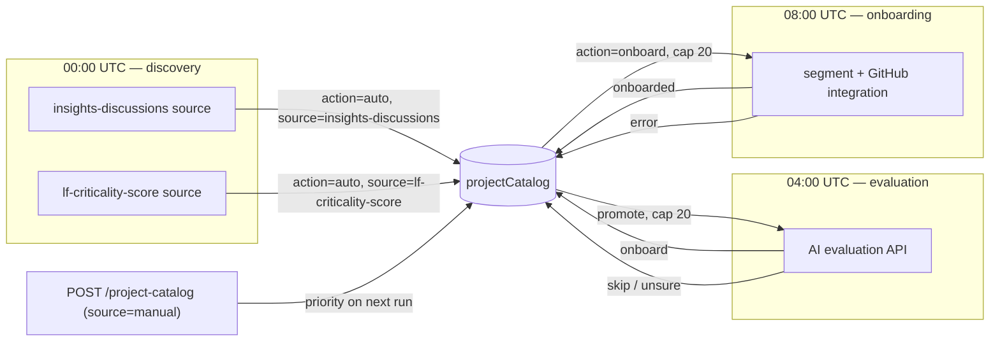

# ADR-0024: Critical projects onboarding pipeline — discovery, evaluation, onboarding

**Date**: 2026-09-11
**Status**: accepted
**Deciders**: Umberto Sgueglia

## Context

CDP is asked to find open-source projects worth tracking and onboard
them without a human in the loop. `projectCatalog` already existed as a staging table, and
discovery and evaluation code had been written, but the pipeline dead-ended: nothing read
`action = 'onboard'` and nothing ever wrote `onboardedAt`. Onboarding itself was still done by
hand from a CSV (`script_executor_worker/src/bin/onboard-projects.ts`). Because there is no
approval gate, the cost of a mistake (a wrong project made public, a bad match) falls entirely
on the caps and the observability built around the pipeline, not on a reviewer.

## Decision

Three independent Temporal workers run daily on staggered schedules, all keyed off the
`projectCatalog` table as the single shared state machine. Discovery caps each of its sources at
20 new projects per run; evaluation and onboarding each cap their own run at 20 projects — all
deliberately conservative so the team can watch pipeline output closely before raising the
volume. A manual API lets any project be injected into any stage out of band, with implicit
priority over the automatic batch. The external LF Criticality Score service, one of the
discovery sources, is now protected by a manually-issued, hashed API key.

### The `projectCatalog` state machine

States (`PROJECT_CATALOG_ACTIONS`, `services/libs/data-access-layer/src/project-catalog/types.ts:1-9`):
`auto → evaluate → onboard | skip | unsure`, `onboard → onboarded | error`, and — for the
soft-deleted-slug case in onboarding step 4 below — `onboard → skip` too. `action` is a
plain `VARCHAR(16)` and `source` a plain `VARCHAR(64)` — neither has a database `CHECK`
constraint, the enum lives only in TypeScript. That is also why adding `source = 'manual'`
later required no migration. The sole idempotency anchor is the unique index
`uix_projectCatalog_repoUrl`: discovery's insert is the only writer that actually upserts against
it (`ON CONFLICT ("repoUrl") DO NOTHING`/`DO UPDATE`); evaluation and onboarding never insert —
they run guarded `UPDATE`s scoped to the row's current `action` instead (see below), with the
onboarding segment lookup in step 1 as the equivalent safeguard against redoing work.

Schema evolved across `V1770653666__add-automatic_projects_discovery-tables.sql` (creation),
`V1778749030__refactor-projects-catalog.sql` (`source`, `action`, `evaluatedAt`, `onboardedAt`),
plus later additions for `evaluationResult`/`evaluationReason`, `onboardingError`, and
`skipReason`.

### Stage 1 — Discovery (`automatic_projects_discovery_worker`)

Schedule `automaticProjectsDiscovery`, cron `0 0 * * *` UTC, `ScheduleOverlapPolicy.SKIP`,
1‑hour catchup window, 5‑hour workflow timeout, 3 retry attempts
(`src/schedules/scheduleProjectsDiscovery.ts`). The `discoverProjects({mode: 'incremental'})`
workflow lists enabled sources, lists each source's datasets, and processes the most recent one
per source; `processDataset` runs with a 90‑minute start-to-close timeout and a 5‑minute
heartbeat.

Sources implement `IDiscoverySource` (`listAvailableDatasets` / `fetchDatasetStream` /
`parseRow`) and are gated by `CROWD_DISCOVERY_SOURCES` — unset means every registered source
runs. Two sources are registered and both are currently enabled:

- `insights-discussions` — reads a dedicated GitHub Discussions category on
  `linuxfoundation/insights` and extracts `github.com/owner/repo` links from the body.
- `lf-criticality-score` — calls the external LF Criticality Score API
  (`GET /projects?page&pageSize=100&scoredAfter`), ordered by score. This source was wired in by
  #4573 (CM-1423); earlier demo material described it as an inactive proof of concept — this
  ADR reflects the pipeline as it runs today, not that snapshot.

New rows are deduplicated in three layers: an in-memory set within the run, a re-check of
existing `repoUrl`s against the **writer** connection (avoiding replica lag), and a final
`ON CONFLICT DO NOTHING` on insert.

### Stage 2 — Evaluation (`projects_evaluation_worker`)

Schedule `projectsEvaluation`, cron `0 4 * * *` UTC, 3‑hour workflow timeout
(`src/schedules/scheduleProjectsEvaluation.ts`). `promoteProjectsToEvaluate` moves rows from
`auto` to `evaluate` with `FOR UPDATE SKIP LOCKED`, ordered by source priority
(`['manual', 'insights-discussions', 'lf-criticality-score']`), then by `lfCriticalityScore`
descending, then by `createdAt`.

Each promoted project is sent to an external AI evaluation service
(`src/evaluator/evaluator.ts`): a form-urlencoded `POST` with a bearer token, against
`https://lfx-ai.onrender.com/agents/insights-onboarding-evaluator/runs`, returning
`{content: {onboard, non_onboard_reason}}`, mapped to `action = onboard | skip` with the
reasoning kept in `evaluationReason`. This is a third-party dependency outside CDP and outside
the LF Criticality Score service — its availability and correctness are out of this ADR's
control. The finalize write is guarded by
`WHERE action = 'evaluate' AND evaluatedAt IS NULL` on the writer connection: a concurrent
manual override that changes the action away from `evaluate` (to `onboard`, or back to `auto`)
wins, since the guard no longer matches. An override that re-posts `action: 'evaluate'` does
not — it resets `evaluatedAt` to `NULL` but leaves the row matching the same guard, so an
in-flight finalize can still overwrite it.

### Stage 3 — Onboarding (`automatic_onboarding_worker`)

Schedule `automaticOnboarding`, cron `0 8 * * *` UTC, 6‑hour workflow timeout, batch size 20
(`src/schedules/scheduleProjectsOnboarding.ts`). For each project, `onboardProject`
(`src/onboarder/onboarder.ts`) runs the following steps against the CDP backend API and GitHub,
in order:

1. **Find or create the project segment.** `POST /segment/project/query`, filtered by derived
   project name under the `lf-oss-index` parent segment. If no exact name match exists,
   `POST /segment/project` creates one (`isLF: false`, parent `lf-oss-index`).
2. **Recover the new segment's id.** The create endpoint doesn't return the created row, so the
   same query is repeated by name immediately afterward to fetch its id.
3. **Enrich from GitHub, in parallel.** Two calls against the GitHub REST API using the first
   configured personal access token: `GET /users/{owner}` for the org's avatar, and
   `GET /repos/{owner}/{repo}` to detect whether the repo is a fork — if it is, the parent
   repo's URL is used as `forkedFrom`, with one special case: the Linux kernel's GitHub mirror
   (`torvalds/linux`) is rewritten to its canonical `git.kernel.org` URL instead of pointing at
   its GitHub parent.
4. **Connect the GitHub integration.** `POST /github-nango-connect` with the org, repo,
   `forkedFrom`, and avatar collected above, mapping the repo URL to the new segment id — this
   is what actually starts data ingestion for the project going forward.

Each backend call has a 30‑second timeout, each GitHub call a 10‑second timeout. A failure at
step 4 leaves a recoverable partial side effect: the segment created in step 1 stays in place
without a GitHub integration, and the project is marked `action = 'error'`
(`markProjectCatalogOnboardingFailed`). `findProjectCatalogPendingOnboarding` only selects
`action = 'onboard'`, so this is **not** retried automatically by the next scheduled run —
recovery needs a manual `POST /project-catalog` with `action: 'onboard'`, which requeues the row
and clears `onboardingError`. Once requeued, the retry itself is safe: step 1 finds the existing
segment instead of recreating it.

The workflow loops sequentially with a try/catch per project; a terminal failure calls
`markProjectOnboardingFailed` (`action = 'error'`, `onboardingError` set) inside its own
try/catch, so neither an onboarding failure nor a failure to record it can abort the batch. A
soft-deleted `insightsProjects` row still owns its slug (the unique index can't be partial on
`deletedAt` — three foreign keys reference it), so onboarding a project onto a deleted slug is
detected and turned into `action = 'skip'` with a `skipReason` instead of a 500 (#4568).

Onboarding calls the CDP backend API rather than writing through the DAL directly: the
onboarding worker cannot import the (Sequelize-based) API services, and the API already
encapsulates the same validations and side effects used by `merge_suggestions_worker`,
`profiles_worker`, and `script_executor_worker` — confirmed with Joana on 2026-08-28 as the
right pattern, not a shortcut to revisit.

### The numbers: 20 projects a day, by design

- Discovery caps new projects at `CROWD_DISCOVERY_NEW_PROJECTS_LIMIT` (default **20**) **per
  source, per `processDataset` call** (`src/config.ts:11-16`); rows the source returns that
  already exist in `projectCatalog` don't count against the cap. The scheduled workflow always
  runs in `incremental` mode, processing exactly one dataset per source, so in practice this is
  20 per source per day — up to 40 new rows in `action = 'auto'` with both sources enabled. A
  manually triggered `full` run instead processes every dataset for a source, and can add up to
  `datasets × 20` rows for that source.
- Evaluation caps the `evaluate` queue at `evaluateLimit: 20` and processes `batchSize: 20` per
  run — this is the real bottleneck of the chain, since it's the stage that decides onboard vs
  skip.
- Onboarding processes `batchSize: 20` per run.

The evaluation and onboarding caps are matched on purpose, but that doesn't guarantee a same-day
flow end to end: onboarding's queue (`findProjectCatalogPendingOnboarding`) is ordered
independently — source priority, then criticality score, then age — so a backlog of older
`onboard` rows can consume today's 20 slots before projects evaluated earlier that same day get
to them. What the caps do guarantee is throughput: at most 20 projects a day are decided on, and
at most 20 a day are onboarded. Discovery feeding in up to 40/day is not a contradiction — any
excess simply waits in `action = 'auto'` and is drained over the following days, in
source-priority order. This is a deliberate observation window, not a technical ceiling —
without a human gate, a bad decision at any stage becomes a real public project or a real
skipped one, and 20/day at the decision point is the volume the team can still watch closely via
the daily Slack report while confidence in the AI evaluation and discovery sources builds up.
Raising it later means adjusting the relevant per-stage limit, not the architecture. (The
`evaluateProjects` workflow's own defaults are 50/50 when triggered manually with no arguments
from the Temporal UI — the schedule itself always passes 20/20.)

### Manual override: `POST /project-catalog`

`backend/src/api/projectCatalog/projectCatalogUpsert.ts`, gated by the `projectCatalogEdit`
permission (admin only). It accepts `action ∈ {auto, evaluate, onboard}` — terminal states
cannot be set manually — canonicalizes the GitHub repo URL, and upserts the row with
`source = 'manual'`, resetting `evaluatedAt` (for `auto`/`evaluate`) or `onboardedAt` /
`onboardingError` (for `onboard`) as needed. It returns 409 when the project is already
onboarded or already mid-onboarding.

The call does not trigger anything directly: the row is picked up by the corresponding stage's
next scheduled run, ahead of the automatic batch, because both
`findProjectCatalogPendingEvaluation` and `findProjectCatalogPendingOnboarding` order by
`(source = 'manual') DESC NULLS LAST` before anything else. This is exactly the design agreed
with Joana — an easy way to push a project through manually that takes priority without
short-circuiting the pipeline. It has already been used in practice: the AI evaluator skipped
`matrixhub-ai/matrixhub` with "project is not mainly run on GitHub", and the call was corrected
by posting `action: 'onboard'` for it directly.

### Criticality score API authentication

The LF Criticality Score service (a separate repo, deployed on a private-network VM) exposes
one endpoint per pipeline stage (`/jobs/discovery`, `/jobs/extraction`, `/jobs/enrichment`,
`/jobs/scoring`) plus `/jobs/orchestrate`, which chains all four; CDP's discovery source only
calls `GET /projects`. The per-stage endpoints stay — they're useful for debugging and
re-running a single stage — but are now locked behind an API key rather than relying on network
placement alone.

Keys are generated manually via the service's CLI, prefixed `lfcs_`, and stored **only as a
scrypt hash** with `read`/`write` scopes; the plaintext is shown once and never committed to the
repo. On the CDP side, `LF_CRITICALITY_SCORE_API_KEY` is sent as `Authorization: Bearer`, and a
401/403 response skips the source's own local backoff loop (used for network errors, 429, and
5xx) and fails immediately (#4597, CM-1406) — but that failure still propagates up to the
`processDataset` activity, which Temporal retries per its own policy (3 attempts), so a bad key
costs three wasted attempts before that source's discovery run fails, not one. The service's own
internal cron (which calls `/jobs/orchestrate` in-process) bypasses this auth by construction —
it never goes over HTTP — which is accepted as intentional, not a gap to close.

### Observability

`services/apps/cron_service/src/jobs/projectCatalogSkipAlert.job.ts` posts a daily Slack report
(17:00 in `cron_service`'s scheduling timezone, `Europe/Berlin` — every job in that service runs
on that clock, not UTC — production only) with per-`action` catalog totals and a breakdown of
the day's skips, flagging cases where the AI's stated reason contradicts the database (e.g.
"already onboarded" for a project CDP has no record of) (#4589, #4606). The skip breakdown query
filters `WHERE action = 'skip' AND evaluationResult = 'false'`, so it only covers evaluation-time
skips; the onboarding-time skip for a soft-deleted slug (Stage 3 above) sets `skipReason` without
touching `evaluationResult`, so it's counted in the catalog totals above but not in this
per-reason breakdown.

## Alternatives Considered

### Alternative 1: Onboarding as a second workflow inside `projects_evaluation_worker`

- **Pros**: reuses the existing task queue and deployment; no new worker to build and deploy.
- **Cons**: couples the onboarding failure/retry profile to evaluation's; a slow evaluation run
  delays onboarding for no reason; scaling or restarting one stage affects the other.
- **Why not**: the three stages have independent failure modes and cadences; a dedicated
  worker with its own schedule lets each stage fail, retry, and scale on its own, and the
  staggered daily schedules give the same chaining effect without runtime coupling.

### Alternative 2: Onboarding writes directly through the DAL instead of calling the CDP API

- **Pros**: one fewer network hop, no service token to manage.
- **Cons**: the onboarding services (segment creation, GitHub integration) are Sequelize-based
  and not importable from a worker; duplicating their validations in the DAL risks the two
  paths silently diverging over time.
- **Why not**: confirmed with Joana on 2026-08-28 that calling the API is the correct and
  deliberate pattern, matching how other workers already integrate with CDP.

### Alternative 3: A human approval step before onboarding

- **Pros**: would eliminate false-positive onboards entirely.
- **Cons**: defeats the point of the epic, which is to remove the human from the loop.
- **Why not**: control was moved downstream instead — the 20/day cap, the daily Slack report,
  and the manual `POST /project-catalog` override to correct mistakes after the fact.

### Alternative 4: Rely on the private network alone for the criticality score API, no API key

- **Pros**: zero additional work; the service was never reachable outside the VPC anyway.
- **Cons**: no way to audit who triggered which stage, and revoking a consumer would mean a
  network-level change rather than revoking one key.
- **Why not**: a manually-issued, hashed API key is cheap to add, gives per-consumer
  auditability and revocation, and keeps the door open to a future read-only external
  consumer without a network change.

## Consequences

### Positive

- Adding a new discovery source is a new class plus one line in the registry.
- `projectCatalog` is the single place to look to know where any project stands in the
  pipeline.
- The manual API covers both "evaluate this now" and "the AI got it wrong, onboard it anyway"
  without separate code paths.
- Throughput is tunable per stage (discovery's env limit, evaluation's `evaluateLimit`/
  `batchSize`, onboarding's `batchSize`), without touching the architecture.

### Negative

- No database `CHECK` constraint on `action` or `source` — correctness relies entirely on
  TypeScript.
- The stages are chained implicitly through staggered daily schedules rather than an explicit
  handoff; a stage that overruns its window pushes its output to the next day.
- All three schedule registrations swallow `ScheduleAlreadyRunning`, so changing a cron
  expression or batch size in code has no effect on an already-registered Temporal schedule
  until it is manually deleted and recreated.
- Evaluation depends on an external AI service CDP does not control.

### Risks

- Evaluation HTTP failures are absorbed as `action = 'unsure'` with `evaluatedAt` already set,
  so Temporal retries never engage; the only recovery path is a manual
  `POST /project-catalog` with `action: 'evaluate'`.
- The external evaluator has already produced false skips (matching by name instead of URL,
  not recognizing existing LF-owned repos); today's mitigation is the daily "contradicting"
  Slack flag, with root-cause fixes tracked separately with the evaluator's team.
- The old `criticalityScores` table is dead in application code but is still CDC-replicated to
  Tinybird and read by two live copy pipes — dropping it is a cleanup task, not a no-op.
- The evaluation queue's soft cap (`evaluateLimit`) only holds because of
  `ScheduleOverlapPolicy.SKIP` preventing concurrent runs.

**Related**: ADR-0017 (same pattern of a multi-stage Temporal pipeline).
