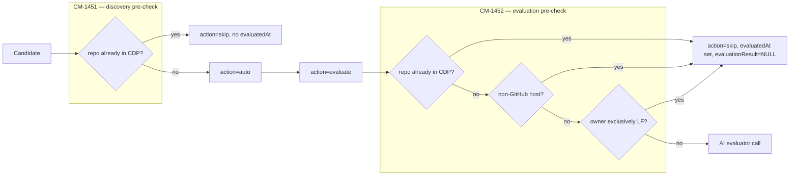

# ADR-0026: Deterministic pre-checks before spending an LLM call or CDP write

**Date**: 2026-09-16
**Status**: accepted
**Deciders**: Umberto Sgueglia

## Context

The critical projects pipeline (ADR-0024) calls an external AI evaluation service for every
project it promotes to `action = 'evaluate'`, even when CDP already has enough of its own data to
answer deterministically. Two concrete costs came from this: money and time — one HTTP call per
project, 30-40s each, against a third-party service CDP doesn't control — and correctness. The
evaluator resolves "is this already an LF project?" with a fuzzy name match against Snowflake,
which is the root cause of a finding raised by Joana: real LF-owned repos (e.g. under `torvalds`,
`kubernetes`) were skipped with reasons that contradicted CDP's own data. CDP cannot fix the
evaluator's matching logic — its API only accepts a `repo_url`, not a correction — so the fix has
to happen before the call, not after it.

`CM-1450` built the underlying capability, `CM-1451` and `CM-1452` are the two places it (and two
other deterministic checks) get applied — one at discovery time, one at evaluation time — because
the pipeline has two separate points where a project can be recognized as "already decided" before
reaching an LLM.

## Decision

We added deterministic, DB-only pre-checks at two of the three pipeline stages, each writing
`action = 'skip'` with a machine-readable `skipReason` and, critically, **without touching
`evaluationResult`/`evaluationReason`** — those columns are reserved for the agent's own verdict,
so the daily skip alert (which filters on them) can tell "we decided this ourselves" apart from
"the agent decided this."

### CM-1450 — the DAL lookup this all depends on

`findGithubOwnersWithLfProjects(qx, owners)` (`services/libs/data-access-layer/src/repositories/index.ts`):
given a batch of GitHub owner names, returns the subset that have at least one repo in
`public.repositories` mapped (via `insightsProjectId`) to a non-soft-deleted `insightsProjects`
row with `isLF = true`. URL matching is regex-based (`~* '^(https?://(www\.)?github\.com/|
ssh://git@github\.com/|git@github\.com:)[^/]+/[^/]+'`), covers the same three URL forms
`canonicalizeRepoUrl` (`@crowd/common`) accepts, and requires an actual `owner/repo` path — an
owner-only URL like `https://github.com/torvalds` does not count as evidence for `torvalds`.

CM-1452 added the symmetric `findGithubOwnersWithNonLfRepos`: a repo with no `insightsProjectId`,
or mapped to a non-LF project, counts as **non-LF evidence** for its owner. "Exclusively LF" is
computed in TypeScript as `lfOwners \ nonLfOwners` (`computeExclusivelyLfOwners`), not a third
query — this keeps both DAL functions independently testable and reusable, and means CM-1450's
original function didn't need to change shape for CM-1452 to build on it.

### CM-1451 — discovery-time pre-check (`automatic_projects_discovery_worker`)

Before a freshly-discovered candidate is even inserted into `projectCatalog`, `findRepoUrlsInCdp`
checks whether its canonical GitHub URL is already tracked in `public.repositories`. A match is
inserted directly with `action = 'skip'` and
`skipReason = 'repository already tracked in CDP (discovery pre-check)'` — it never becomes
`action = 'auto'`, so it never reaches the evaluation queue at all. This is the cheapest possible
place to catch a duplicate: no evaluation slot consumed, no LLM call ever scheduled. Counted
separately from the evaluator's own dedupe as `skippedAlreadyInCdp` in the pipeline run stats and
per-source workflow breakdown.

### CM-1452 — evaluation-time pre-check (`projects_evaluation_worker`)

A row can still reach `action = 'evaluate'` without having been caught at discovery — most
notably a `source = 'manual'` row posted directly via `POST /project-catalog`. So a second,
independent pre-check runs as its own activity (`precheckPendingProjects`) right after
`fetchPendingProjects` and before the evaluation loop, applying three criteria in order — cheapest
and most certain first, so a row is skipped for the first reason that actually applies:

1. **Not GitHub** — `canonicalizeRepoUrl` returns `isGithub: false` (or fails to parse a URL at
   all is *not* a skip; it falls through to the agent, since a parse failure means we don't
   actually know, not that we know it's a non-GitHub host).
2. **Already in CDP** — same `findRepoUrlsInCdp` lookup CM-1451 uses, as a safety net for rows
   that skipped the discovery stage.
3. **Owner exclusively mapped to LF projects in CDP** — the CM-1450 lookup, restricted to owners
   with zero non-LF evidence. This is the one that actually closes Joana's finding: a repo under
   `kubernetes` never needs the agent's (fuzzy, wrong) opinion on whether it's already an LF
   project, because CDP already knows.

The three DB lookups (`findRepoUrlsInCdp`, `findGithubOwnersWithLfProjects`,
`findGithubOwnersWithNonLfRepos`) run once per batch via `Promise.all`, not once per project, and
`canonicalizeRepoUrl` is computed once per project and reused across all three checks and the
resolution step. The skip write (`markProjectCatalogPreCheckSkipped`) is guarded exactly like the
agent's own `finalizeProjectCatalogEvaluation` — `WHERE action = 'evaluate' AND evaluatedAt IS
NULL` — and additionally nulls `evaluationResult`/`evaluationReason` so a row that was manually
re-queued after already carrying a stale agent verdict doesn't resurrect that verdict under a
`skip` it never actually reached. A retried activity hitting a row it already skipped in a prior
attempt (0 rows updated, but the row already matches the same `action`/`skipReason`) is counted
as skipped rather than silently dropped or misreported as a manual override.

### Alert visibility

`projectCatalogSkipAlert.job.ts`'s existing skip breakdown (ADR-0024) filters
`evaluationResult = 'false'`, so pre-check skips are excluded from it by construction — they were
never an agent verdict. A separate section was added, grouping `skipReason LIKE 'evaluation
pre-check:%'` counts for the day, so pre-check volume is visible without being mixed into the
agent's own contradiction-flagging logic. This SQL stays inline in the job file rather than moving
into the DAL, matching the de-facto convention nearly every other `cron_service` job already
follows for its own read-only reporting queries — a deliberate choice to not touch that pattern as
part of this work.

## Alternatives Considered

### Alternative 1: "Owner has at least one LF project" instead of "owner is exclusively LF"

- **Pros**: simpler query (drop the non-LF lookup and the set difference entirely); catches more
  cases.
- **Cons**: owners like `google`, `microsoft`, `ibm`, `redhat` have both LF-mapped and non-LF
  repos in CDP. This variant would silently skip a legitimate, un-evaluated repo under one of
  those owners without the agent ever seeing it.
- **Why not**: too coarse for a skip decision with no human review downstream — being
  conservative here (requiring zero non-LF evidence) was a deliberate trade-off discussed and
  agreed on before implementation, accepting fewer skips in exchange for zero false skips.

### Alternative 2: Override the agent's own verdict on rows it already evaluated

- **Pros**: could retroactively correct past evaluator mistakes rather than only preventing new
  ones.
- **Cons**: explicitly out of scope for this ticket, and conflates two very different guarantees —
  "we know better than the agent" vs. "we didn't ask the agent."
- **Why not**: the pre-check only ever intercepts rows before the HTTP call is made; a row the
  agent already decided on is left untouched.

### Alternative 3: One combined SQL query for LF/non-LF owner classification

- **Pros**: a single table scan instead of two.
- **Cons**: `findGithubOwnersWithLfProjects` is CM-1450's own tested, shared DAL function with its
  own call sites; folding it into a new combined query changes its contract and couples the two
  tickets' DAL code together.
- **Why not**: `data-access-layer` is explicitly called out as high-blast-radius in the root
  `CLAUDE.md` — adding a second, independent function and composing the result in TypeScript was
  judged safer than reshaping a function other code already depends on. Flagged as a known,
  accepted performance trade-off (see Risks).

## Consequences

### Positive

- Cost and latency are avoided entirely for the three deterministic cases, with the savings
  visible per-reason in both the discovery breakdown and the new evaluation-pre-check alert
  section.
- The exclusively-LF-owner check directly closes Joana's finding for every future project under an
  owner CDP already fully recognizes as LF, without needing any change on the evaluator's side.
- Both pre-checks reuse the exact same guarded-write pattern already established for the agent's
  own verdict (ADR-0024), so the state machine gained two new skip reasons without gaining a new
  write pattern to reason about.

### Negative

- Two independent pre-check implementations exist (discovery-time, evaluation-time) rather than
  one shared module, because they run in different workers against different inputs (a raw
  discovered row vs. an already-persisted `projectCatalog` row).
- `findRepoUrlsInCdp`, `findGithubOwnersWithLfProjects`, and `findGithubOwnersWithNonLfRepos` each
  scan `public.repositories` with a regex predicate and no supporting index, run on every
  evaluation batch — at repository scale this could offset some of the LLM-cost savings the
  feature exists to deliver.

### Risks

- The performance trade-off above is a known, deliberately deferred risk: fixing it means either
  an index/migration change or reshaping shared DAL functions, both judged out of scope for this
  change given `data-access-layer`'s blast radius; it should be revisited if evaluation batch
  latency becomes a problem in practice.
- The "exclusively LF" criterion is only as accurate as CDP's own `insightsProjects.isLF` mapping
  and repo-URL data; if a repo's ownership data in CDP is itself wrong, the pre-check will now
  skip confidently on bad data instead of asking the agent, with no contradiction flag equivalent
  to the one that exists for agent verdicts.
- The regex-based owner/URL matching only recognizes GitHub URLs in the same three forms
  `canonicalizeRepoUrl` accepts (https, `ssh://git@`, and scp-style `git@host:`); a URL form CDP
  starts storing outside of these would silently stop counting as evidence rather than erroring.

**Related**: ADR-0024 (the pipeline these pre-checks run inside), ADR-0022 (ownership evidence,
same "evidence for vs. against" pattern applied to a different problem).
