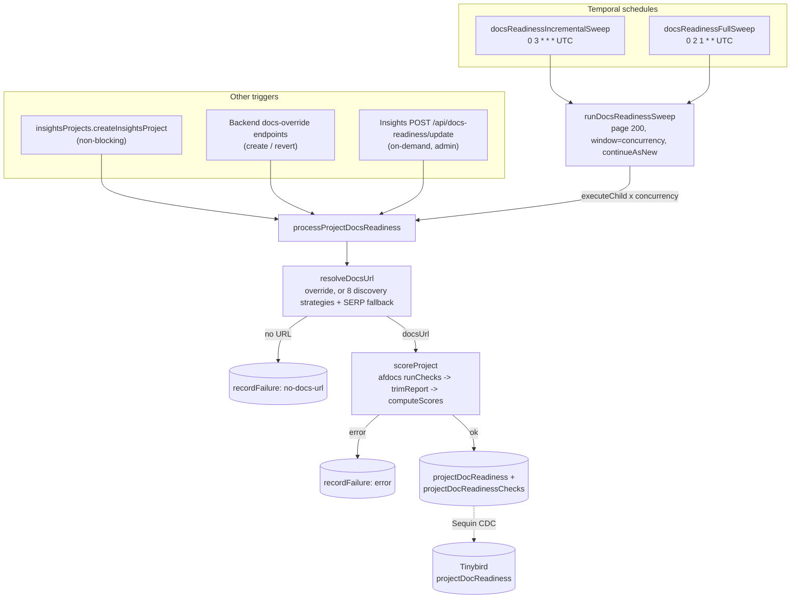

# ADR-0030: Docs readiness worker — architecture

**Date**: 2026-09-23
**Status**: accepted
**Deciders**: Gašper Grom, Joana Maia (spec author)

## Context

LFX Insights wanted a per-project "documentation readiness" score, surfaced via a new
`projectDocReadiness` Tinybird datasource, so projects with missing or low-quality docs can
be identified programmatically. A proof of concept (`joanagmaia/ai-documentation-poc`)
already validated the scoring approach (an external `afdocs` checker running ~23 checks
against a discovered docs URL) but had no production home: no worker, no schema, no
scheduling, and a discovery-candidate ranker that occasionally picked a project's own GitHub
repo as its "docs site." The accepted spec (`attachments/IN-1305/specs.md`) fixed the
scoring formula and confidence table; this ADR covers the worker and pipeline built to run
it in production.

## Decision

A new Temporal worker, `docs_readiness_worker` (task queue `docs-readiness`), owns the full
pipeline: discover a project's docs URL via eight ranked strategies (with a metered SerpAPI
fallback), score it with `afdocs`, and persist the result. Two workflows do the work — a
per-project child (`processProjectDocsReadiness`) and a paginated sweep parent
(`runDocsReadinessSweep`) that fans children out in windows of `concurrency` (default 10)
and `continueAsNew`s across pages of 200. Two Temporal schedules drive it: a daily
incremental sweep (`0 3 * * *` UTC, only projects with no successful prior run) and a
monthly full sweep (`0 2 1 * *` UTC, every enabled project regardless of prior state). The
pipeline runs **LF-scoped projects only** (`isLF = true, enabled = true, deletedAt IS
NULL`) to start; an `'all'` scope already exists as a workflow argument for a future
Phase 2, with no code change needed to turn it on.

## Alternatives Considered

### Alternative 1: Run scoring inline from the backend request path

- **Pros**: No new worker, no Temporal scheduling to build.
- **Cons**: `afdocs` runtime is unbounded by design (POC P95 123s, max seen 300s); a
  1103-project backfill would block or need its own ad-hoc batching logic; no retry/backoff
  semantics for free.
- **Why not**: Temporal already gives idempotent retries, `continueAsNew` pagination, and a
  schedule primitive for free — reinventing that inline was strictly worse for a workload this
  bursty.

### Alternative 2: Reuse `projectCatalogPipelineRuns` for run tracking

- **Pros**: One fewer table, matches the existing project-catalog onboarding pipeline's run
  ledger.
- **Cons**: That table's shape is specific to the catalog state machine (discovery → evaluate →
  onboard), not to a scored/rescored-per-day workload.
- **Why not**: Explicit user preference for a dedicated `projectDocReadinessRuns` table over
  overloading an existing one with a different lifecycle.

### Alternative 3: Store raw check results as JSONB on `projectDocReadiness`

- **Pros**: Fewer tables, matches the POC's own shape.
- **Cons**: POC JSONB blobs averaged 171 KB and peaked at 20 MB per project — expensive to
  store and to CDC into Tinybird, and not queryable per check ("which checks fail most
  often" needs a real WHERE clause, not a JSONB scan).
- **Why not**: Spec author asked for a maintainable Postgres model, no object storage,
  "not necessarily JSONB." `projectDocReadinessChecks` (one row per check, latest only,
  `details` capped at 32 KB, replaced atomically per project) is queryable and bounded.

### Alternative 4: `scope: 'all'` from day one

- **Pros**: One rollout instead of two, no revisit needed to unlock non-LF projects.
- **Cons**: 1103 LF projects alone already surfaced real first-run behavior worth watching
  closely (see Consequences); running against the full non-LF catalog on day one would have
  multiplied external HTTP/GitHub API/SerpAPI load and blast radius before anyone had seen
  the pipeline run once.
- **Why not**: `scope` is already a workflow argument (`'lf' | 'all'`), so widening later is an
  operational decision (change the schedule's args), not a code change or migration.

## Consequences

### Positive

- Discovery and scoring are fully decoupled from request paths — a slow or hung `afdocs`
  check on one project can't block others outside its own concurrency window.
- `projectDocReadinessRuns` gives a single place to answer "did the last sweep finish, and
  how many projects did it touch" without querying Tinybird.
- The incremental-sweep filter (`latest.ok IS DISTINCT FROM TRUE`) means the pipeline is
  self-backfilling: turning it on for the first time swept the entire existing LF catalog
  (1103/1103 projects) on the very first scheduled run, with no manual backfill step.
- `scope: 'all'` is a one-line schedule-argument change away, not a re-implementation.

### Negative

- Discovery makes real outbound calls (project websites, GitHub API, optionally SerpAPI) at
  whatever concurrency the sweep runs at — this is external network load the team now owns
  operationally, not just compute.
- SerpAPI is a metered, paid fallback; nothing in-code currently caps total spend across a
  sweep beyond "only called when the other 7 strategies found no live candidate."

### Risks

- **A single slow project can stall a whole concurrency window.** `Promise.allSettled` waits
  for all `concurrency` (default 10) children in a window before starting the next; one
  project hitting close to its 30-minute `scoreProject` timeout (with 2 attempts) can hold up
  the other 9 already-finished slots' visible progress for up to ~60 minutes. Observed live on
  the first production incremental sweep (progress briefly stalled for ~30 minutes on one
  window, then resumed normally) — not a correctness bug, but worth having monitoring for
  (see below).
- **No proactive alerting yet on run-level failure.** `runDocsReadinessSweep` already records
  `status: 'failed'` with `errorMessage` on an unexpected error, and the shared
  `ActivityMonitoringInterceptor` (via `services/archetypes/worker`) already posts to the
  `CDP_ALERTS` Slack channel on high per-activity retry counts (≥50 attempts) — but nothing
  yet pages on a `projectDocReadinessRuns.status = 'failed'` row, or on a completed run with
  an abnormally high `failed / totalProjects` ratio. Tracked as a follow-up (see monitoring
  ticket linked from IN-1305).
- **GitHub auth is a shared installation token**, reused from the existing stars-worker
  installation (`getGithubInstallationToken()`), not a dedicated app. Acceptable at ~3 API
  calls per project; a dedicated app is an env-value change in `crowd-kube`, not a code
  change, if the shared installation's rate limit ever becomes a problem.
