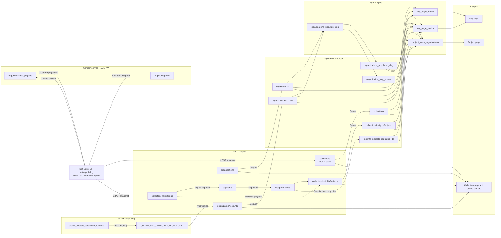

# Open Source Stacks: architecture

**Date**: 2026-09-30
**Status**: proposed
**Owner**: Joana Maia
**Product spec**: [Open Source Stacks Design Spec (14 Sep 2026)](../product-specs/open-source-stacks.md)
**Related ADRs**: [ADR-0032: Explicit `collections.type` discriminator](../adr/0032-collection-type-discriminator.md), [ADR-0033: Salesforce account slugs for Insights org pages](../adr/0033-salesforce-org-slugs.md), [ADR-0034: Salesforce data from Snowflake reaches Insights through CDP](../adr/0034-snowflake-salesforce-data-through-cdp.md)
**Prior approved decisions**: [pcc_sync_worker pattern for Snowflake → CDP syncs](https://docs.google.com/document/d/1t6HyZdHGM9TA47fyJ5jRQ96z4O5esmnCDu03yNS4lwI/edit?tab=t.0#heading=h.n2bz17vu9svn)

## 1. Summary

An Open Source stack is a public collection owned by a company. A company admin builds it as a workspace in Org Lens (LFX Self-Serve) and publishes it to LFX Insights, which shows it on the Collections tab, on the company's org page, and on the page of every project it includes.

Insights readers see a stack as a collection, but a workspace and a collection are two entities in two systems:

- A **workspace** is a company's named list of projects. It lives in lfx-v2-member-service, and only the company's Org Lens users can see it.
- A **collection** is a public list of projects on Insights, stored in CDP Postgres.

A workspace becomes a collection only when someone publishes it. Publishing creates a `collections` row with `type = 'stack'` linked to the workspace ID, and unpublishing soft-deletes it, so unpublished workspaces never reach CDP or Insights.

Three systems are involved: people create, edit and publish workspaces in **Self-Serve**, **CDP** stores the published ones as collections, and **Insights** displays them.

```mermaid
flowchart LR
  subgraph SelfServe["LFX Self-Serve"]
    UI[Org Lens Projects page]
    BFF[Express BFF]
  end
  subgraph LFXv2["LFX v2"]
    MS[(member-service<br/>workspaces)]
    AC[access-check]
    QS[query-service]
  end
  subgraph CDP["CDP (crowd.dev)"]
    API[Public API]
    PG[(Postgres)]
    SYNC[Salesforce sync worker]
  end
  SF[(Snowflake)]
  TB[(Tinybird)]
  INS[LFX Insights]

  UI --> BFF
  BFF -- workspace edits --> MS
  BFF -- checks user access --> AC
  BFF -- publish, update, unpublish --> API
  API --> PG
  SF --> SYNC --> PG
  PG -- Sequin CDC --> TB
  INS -- collection pages --> PG
  INS -- org page and project page --> TB
  INS -- checks user access --> AC
  INS -- lists user's companies --> QS
  INS -- Create and Manage links --> UI
```

### Data model mapping

This diagram shows where each table comes from, where it lands, and which Insights surface reads it. Tinybird datasources that copy a Postgres table keep the table's name.

- `organizationAccounts` is the only new source of Salesforce data, and every Insights surface that shows a company joins it on the CDP org ID.
- Only the CDP public API writes stack rows and their project links. The Self-Serve BFF calls it once member-service confirms the workspace write, sending the project list member-service returned along with the collection name and description from the settings dialog. Nothing reads NATS KV directly.
- The collection page and the Collections tab read Postgres directly, while the org page and project page read Tinybird.

## 2. How each system identifies a company

| System            | Company ID                                                                 |
| ----------------- | -------------------------------------------------------------------------- |
| Org Lens, LFX v2  | Salesforce account ID (SFID)                                               |
| CDP               | `organizations.id` (UUID)                                                  |
| Insights org page | Org slug, which resolves to CDP ID. Salesforce slug for matched orgs (C10) |

CDP has no SFID today, but the warehouse already matches CDP orgs to Salesforce accounts in `_SILVER_DIM_CDEV_ORG_TO_ACCOUNT` (lf-dbt), the model Org Lens uses. It matches by domain first, then by name, then by a manually maintained Google Sheet.

## 3. Constraints and decisions

### C1: Mapping Org Lens companies to CDP organizations

**Problem.** A stack belongs to a Salesforce account, but Insights pages are keyed by CDP org, and CDP has no way to translate one into the other.

**Decision.** Copy the warehouse mapping into a new CDP table, `organizationAccounts`, with one row for every CDP org the warehouse matches to a Salesforce account:

| Column           | Content                                                  |
| ---------------- | -------------------------------------------------------- |
| `accountId`      | SFID, primary key                                        |
| `organizationId` | CDP org ID, unique                                       |
| `accountName`    | Salesforce account name                                  |
| `accountLogoUrl` | Salesforce logo, nullable                                |
| `accountSlug`    | Salesforce slug, lowercased, nullable (C10)              |
| `matchMethod`    | `domain`, `name`, or `manual`, copied from the dbt model |
| `syncedAt`       | Last sync time                                           |

- A scheduled job loads the table from Snowflake, following the [approved `pcc_sync_worker` pattern](https://docs.google.com/document/d/1t6HyZdHGM9TA47fyJ5jRQ96z4O5esmnCDu03yNS4lwI/edit?tab=t.0#heading=h.n2bz17vu9svn) (export to S3, then a consumer upserts). Insights gets Salesforce data only through CDP rather than through a Snowflake connector in Tinybird ([ADR-0034](../adr/0034-snowflake-salesforce-data-through-cdp.md)). The dbt model gains one output column, `account_slug`, for C10.
- Each run upserts every pair the model returns and deletes the pairs it no longer returns. An org added to CDP later, or a Salesforce account matched later, gets its row on the first run after the warehouse matches it.
- The table holds only Salesforce-side values and copies no CDP org fields such as `displayName` or `logo`. Readers work out the display name and logo by left joining `organizations` to `organizationAccounts`, taking the Salesforce value when there is one and the CDP value otherwise.
- Insights uses that joined name and logo wherever it shows a company (stack cards, stack owner attribution, the org page header), joining on the CDP org ID it already has.
- When CDP merges two orgs, the merge workflow updates `organizationAccounts.organizationId` right away instead of waiting for the next warehouse run.
- The same table could replace domain and name guessing in the LFX memberships import (`backend/src/bin/scripts/import-lfx-memberships.ts`). **Automating that import is out of scope for this project (C11).**
- Sequin replicates the table to Tinybird so the new pipes can join on it.

**Stacks from companies with no CDP match.** A stack always stores its owner's SFID (`ownerAccountId`) plus the owner's name and logo (`ownerName`, `ownerLogoUrl`), which Self-Serve sends from Org Lens on every publish and update. The collection page shows that name as the owner. Because the company has no org page on Insights, the owner isn't linked and the stack doesn't appear on project pages. Once the mapping sync adds the company, the join resolves its CDP org: the stack appears on the org page and project pages and the owner name switches to the joined value, with no change to the stack row.

### C2: Who owns a stack, and where that is checked

**Problem.** Stacks are created and edited only in Self-Serve, but Insights shows owner-only buttons (Create, Manage, owner empty states), and the spec says these must never appear when clicking would fail (§5). Insights doesn't know which company a signed-in user belongs to, and today the org page sends everyone to Org Lens, including people who can't open it.

**Decision.**

- A user owns a company's stacks if they have `writer` on that company's `b2b_org` in LFX v2, which in the FGA model also covers `owner` and `global_org_admin`. Viewers (`auditor`) can see the workspace in Org Lens but can't publish.
- Self-Serve enforces this before it writes anything. The LFX v2 gateway checks workspace writes to member-service (Heimdall rule `b2b_org#writer`), and before calling CDP the BFF checks `writer` itself with the same access-check call Insights uses below.
- Insights reads the same permission only to decide which buttons to show. A link from Insights grants nothing, because Self-Serve checks again when the user arrives.
- The Create button in the Collections tab and My collections empty states shows when the user is a writer on at least one company. Manage on a collection page, and the create prompt and "Manage Open Source stacks" link on an org page, show when the user is a writer on that company.
- The Insights server calls LFX v2 through its API gateway with the user's own token, using the same two services Self-Serve uses:
  - **One company** (collection page, org page): lfx-v2-access-check, `POST /access-check` with `{ "requests": ["b2b_org:<SFID>#writer"] }`, which answers `true` or `false` at the end of each response line. Self-Serve's client is `apps/lfx-one/src/server/services/access-check.service.ts`.
  - **Any company** (Collections tab, My collections): LFX v2 has no single endpoint for this. Self-Serve builds the list in `apps/lfx-one/src/server/services/org-role-grants.service.ts` from lfx-v2-query-service: `GET /query/resources?type=b2b_org_settings&tags=member:<username>` returns the companies the user was granted `writer` or `auditor` on directly, `tags=parent_b2b_org_uid:<SFID>` finds subsidiaries that inherit the grant, and a batched `/access-check` confirms them. Insights repeats only the first and last steps, since it just needs to know whether the list of writer companies is empty.
  - Insights caches the answers for the session and hides the buttons if LFX v2 is down.
- The roster in `b2b_org_settings` lists only users granted a role in Org Lens. An `owner` or `global_org_admin` without a listed grant passes the single-company check but not the "any company" check, so they see Manage but not the Create button in the Collections tab. Self-Serve has the same gap today.
- The spec's "verified employee by email domain" (§1.2) becomes "has writer access in Org Lens", and Product needs to agree to that wording.
- We also fix the existing org page: its Org Lens links (`header.vue`, `locked-contributors-section.vue`) show only to users with at least `auditor` on that company, and open that company's page (`/org/<slug or SFID>/projects`) instead of a generic one.

### C3: Collections owned by a company

**Problem.** Today a collection counts as "curated" whenever `ssoUserId` is empty. A company-owned stack has no `ssoUserId`, so every curated list would pick it up.

**Decision** (details in [ADR-0032](../adr/0032-collection-type-discriminator.md)):

- Add `collections.type` with values `curated`, `community`, `stack`, backfilled from `ssoUserId` for existing rows.
- Every curated filter in Tinybird and Insights switches to `type = 'curated'`, and this ships before any stack is written.
- New columns for stacks: `workspaceId` (member-service workspace UID), `ownerAccountId`, `ownerName`, `ownerLogoUrl`, `publishedAt`, `createdByUsername`, `updatedByUsername`. `ownerName` and `ownerLogoUrl` are used only while the owner has no CDP match (see C1).
- `workspaceId` is unique among stacks, so a workspace has at most one collection.
- Stacks are always `isPrivate = false`, because unpublishing soft-deletes the row (`deletedAt`) instead of hiding it.
- The collection name and description are entered in the workspace settings dialog when publishing (spec §7.3) and stored only on the collection. The workspace keeps its own name in member-service.

### C4: Where workspaces live, and how published ones reach CDP

**Problem.** Workspaces live in lfx-v2-member-service, in two NATS KV buckets:

- `org-workspaces`, one key per company (`org-workspaces.<SFID>`), holding every workspace's UID, name, and audit fields.
- `org_workspace_projects`, one key per workspace (`org_workspace_projects.<workspace UID>`), holding its projects as `project_slug` and optional `project_name`.

member-service has no read API. Instead it publishes `lfx.index.org_workspace` and `lfx.index.org_workspace_project` events, the indexer writes them to OpenSearch, and Self-Serve reads them back through query-service. Those indexed documents are private (`Public: false`, readable with `auditor` on the company) and have no public or published field.

**Options.**

1. **Insights reads workspaces from LFX v2.** Not feasible. Query-service returns workspaces only to users with `auditor` on the company, so anonymous visitors couldn't see a stack. Tinybird can't read NATS or OpenSearch either, so org and project pages would have to call LFX v2 on every request, and the project page would need a cross-company search by project slug that LFX v2 doesn't offer.
2. **Replicate every workspace from NATS KV into CDP.** CDP would need its first NATS consumer, plus a reconciliation job because the events are fire-and-forget, and it would copy private workspaces that Insights never shows.
3. **Copy a workspace into CDP only when it is published.** Recommended.

**Decision.** Workspaces stay in member-service, unchanged. When a writer turns on the public toggle and saves, the Self-Serve BFF sends CDP a full snapshot of the workspace (collection name, description, project slugs and names, owner name and logo, and the user's LFID), and CDP creates or updates the collection for that `workspaceId`. Edits to a published workspace go to member-service first, then the BFF sends the new snapshot to CDP. The snapshot's project list is the one member-service returns after the write rather than what the page shows, so CDP only receives projects member-service has stored. Unpublishing, or deleting a published workspace, soft-deletes the collection, and republishing restores the same row so the collection keeps its URL.

CDP is the record of whether a workspace is published: Self-Serve reads a company's published stacks from CDP to show the Published tag and URL, and member-service needs no change.

The API is part of the crowd.dev public API, uses Auth0 machine-to-machine tokens and Zod validation (`validateOrThrow`), and includes the company's SFID in every route:

| Method | Path                                     | Purpose                              | Scope              |
| ------ | ---------------------------------------- | ------------------------------------ | ------------------ |
| GET    | `/v1/org-stacks/:accountId`              | Published stacks for a company       | `read:org-stacks`  |
| PUT    | `/v1/org-stacks/:accountId/:workspaceId` | Publish, or update a published stack | `write:org-stacks` |
| DELETE | `/v1/org-stacks/:accountId/:workspaceId` | Unpublish (soft delete)              | `write:org-stacks` |

- **Permissions.** The Self-Serve server checks `writer` in LFX v2 before calling CDP and passes the user's LFID for the audit columns. CDP trusts Self-Serve the way it already trusts callers of `write:organizations`.
- **PUT is idempotent.** It replaces the stack's name, description and project list with the snapshot, so a failed call can be retried with the same body, and a retry after a later edit can't leave old projects behind.
- **Drift.** If the member-service write succeeds and the CDP call fails, the published stack lags the workspace until the next save. The BFF retries, and if the retry fails it tells the user the public page wasn't updated.
- **Getting data to Insights.** Sequin already replicates `collections` and `collectionsInsightsProjects` to Tinybird, and the new tables are added to the Sequin publication.
- **New runtime dependency.** Publishing, and editing a published workspace, fail if the CDP API is down. Private workspaces don't depend on CDP.

### C5: Matching workspace projects to Insights projects

**Problem.** Workspaces list projects by LF project slug, and some of those projects aren't on Insights at all.

**Decision.**

- New table `collectionProjectSlugs(collectionId, projectSlug, projectName, addedBy, createdAt)` holds every project in the published workspace, exactly as Self-Serve sent it.
- CDP fills `collectionsInsightsProjects` for the slugs it can match, by looking up `segments.slug` by the LF slug and then the Insights project with that `segmentId`. Project segments created through CDP use the LF slug as `segments.slug`, so LF projects match out of the box, and matching on `segmentId` doesn't depend on `insightsProjects.slug`.
- **Bug to fix.** When `pcc_sync_worker` creates an Insights project (`pccProjectConsumer.ts`), it sets `slug = generate_slug('insightsProjects', name)`, deriving the slug from the project name instead of the PCC project slug that Insights projects created through CDP use. Stack matching works either way, but those Insights project URLs differ from the LF slug.
- Projects that don't match stay in `collectionProjectSlugs` without appearing on Insights, and Self-Serve shows "N projects not yet on Insights".
- When a project is added to Insights, CDP links it to any stacks that already list it, either through a hook in `pcc_sync_worker` or a small cron job. We pick one during implementation.
- **Known gap.** `segments.slug` doesn't change when a project's LF slug changes (`pccProjectConsumer.ts` only logs the drift), so projects with a changed slug stay unmatched until that sync is automated.

### C6: Links between Insights and Self-Serve

**Problem.** People start on Insights but create and edit stacks in Self-Serve, which has no link that opens the settings dialog directly and no way to send the user back to Insights.

**Decision.**

- Self-Serve keeps its company switcher, and each page shows one company.
- **Create from the Collections tab or My collections** opens `/org/projects?action=new-workspace&returnTo=<Insights URL>` for the company already selected in Self-Serve.
- **Create from an org page** opens `/org/<slug or SFID>/projects?action=new-workspace&returnTo=…`.
- **Manage on a collection page**, which replaces the like button for owners, opens `/org/<slug or SFID>/projects?workspace=<workspaceId>&settings=open&returnTo=…`.
- **"Manage Open Source stacks" on an org page**, below the stack list, opens `/org/<slug or SFID>/projects?returnTo=…`.
- Self-Serve changes:
  - Support the `action` and `settings` parameters.
  - Add a public toggle, collection name, and description to the settings dialog. Both fields are required when the toggle is on.
  - Show published workspaces with a tag, their URL, and a menu.
  - Ask for confirmation before unpublishing.
  - Point the LF logo back to `returnTo`, allowing only the Insights host.

### C7: Project page, "Organizations with this project in their Open Source stacks"

**How Insights reads Tinybird today.** Sequin copies Postgres tables into Tinybird datasources with the same names (`collections`, `collectionsInsightsProjects`, `organizations`). Each copy keeps every version of a row, so readers add `FINAL` to get the latest one. A pipe is a named SQL query over datasources that Tinybird serves as an HTTP endpoint, and the Insights server calls pipes by name (`/v0/pipes/<name>.json`) from its API handlers, passing URL values such as the project slug as parameters. The project page already passes its slug to pipes that filter `insights_projects_populated_ds`, Tinybird's table of Insights projects.

**Decision.** New pipe `project_stack_organizations`, called from a new Insights handler with the project slug. It:

1. Finds the project's ID in `insights_projects_populated_ds`.
2. Finds the stacks that include it in `collectionsInsightsProjects`, keeping only `collections` rows with `type = 'stack'` and no `deletedAt`.
3. Turns each stack's `ownerAccountId` into a CDP org through `organizationAccounts`, dropping stacks whose owner has no match since they have no org page to link to.
4. Returns one row per company with the joined name and logo (C1), `headline` as the description, `employees`, and the org slug from `organizations_populated_slug` for the link.

The section sits in the left column of the project overview, below the health scorecard.

### C8: Several stacks on one org page

**How the org page reads Tinybird today.** The org page URL holds the org slug, and each section calls its own pipe (`org_page_profile`, `org_page_kpis`, `org_page_projects`, …). Each pipe first turns the slug into the CDP org ID through `organizations_populated_slug`, a datasource that `organizations_populate_slug` rebuilds every hour (C10).

**Decision.** New pipe `org_page_stacks`, called with the org slug. It:

1. Turns the slug into the CDP org ID through `organizations_populated_slug`.
2. Finds the company's SFID in `organizationAccounts`.
3. Lists the `collections` rows with that `ownerAccountId`, `type = 'stack'` and no `deletedAt`.
4. Returns name, slug, description, project count and the first few project logos (from `collectionsInsightsProjects` and `insights_projects_populated_ds`), newest first by `greatest(publishedAt, updatedAt)`.

### C9: Where Insights reads stacks from

**Decision.**

- The collection page, the Collections tab, and search read from Postgres, as collections do today (`communityCollection.repo.ts`), filtered to `type = 'stack'` and `deletedAt IS NULL`, so an unpublished stack returns 404 immediately.
- The org page list (C8) and the project page list (C7) read from Tinybird, which lags behind Postgres. After an unpublish, an org or project page can link to the removed stack for a short time, and we accept that.
- The Tinybird `collections` datasource needs `type`, `workspaceId`, `ownerAccountId`, `ownerName`, `ownerLogoUrl`, `deletedAt`, and `publishedAt`.

### C10: Org page slugs

**Context.** Insights org slugs were generated from the org name because neither CDP nor Insights had an org slug to use, and they were always meant to switch to the Salesforce slug once Salesforce data was integrated.

**Problem.** The slugs exist only in Tinybird, where `organizations_populate_slug.pipe` rebuilds them every hour from `displayName`. A rename changes the slug, two orgs with the same name can swap slugs as their contribution counts change, and old slugs return 404. Org Lens, meanwhile, addresses the same company by its Salesforce slug.

**Decision** (details in [ADR-0033](../adr/0033-salesforce-org-slugs.md)):

- A matched org uses its `organizationAccounts.accountSlug` when that is a valid slug (`[a-z0-9-]`, not SFID-shaped). Every other org keeps the name-based slug.
- Salesforce slugs win collisions: a name-based slug that clashes with one gets `--N`, and if two matched accounts share a Salesforce slug, the one with more contributions keeps it.
- New Tinybird datasource `organization_slug_history (slug, organizationId, lastSeenAt)`, seeded with today's slugs and appended by each hourly run.
- When an Insights org URL isn't a current slug, Insights looks it up in the history and answers with a 301 to the org's current slug. Current slugs are checked first, so a reused slug goes to its current owner.
- Rollout: history and redirect first, then the slug rule.
- For matched orgs the Insights slug equals the Org Lens slug, so the Org Lens links in C2 and C6 reuse it.

### C11: LF memberships from Snowflake

**Out of scope for this project.** It's recorded here because it reuses the sync worker and `organizationAccounts` from C1 and should be built on top of them after Open Source Stacks ships.

**Problem.** `lfxMemberships` is loaded by hand from a CSV (`import-lfx-memberships.ts`) and matched to CDP orgs by domain and name. It has no SFID and is unique on `accountName`, yet org pages read it for the membership badge and the Org Lens redirect.

**Decision.**

- The Salesforce sync worker (C1, [ADR-0034](../adr/0034-snowflake-salesforce-data-through-cdp.md)) gains a second export, `silver_dim_memberships`, keyed by account SFID and project SFID.
- It writes to a new table, `organizationMemberships`, keyed by `accountId`, project SFID and membership term. The table stores no `organizationId`, so readers join `organizationAccounts` as stacks do. Memberships of unmatched companies are kept and appear once the mapping exists, and org merges only touch `organizationAccounts`.
- The project SFID matches `segments.sourceId`.
- `lfxMemberships` keeps serving until the two tables agree per project. Then `org_page_profile` and the other readers switch over, and `lfxMemberships` and the CSV script are removed.

## 4. What happens when

### Publishing

1. On Insights, the owner clicks Create or Manage and lands in Self-Serve.
2. They turn on the public toggle, enter a collection name and description, and save.
3. Self-Serve checks they are a writer for that company, then calls `PUT /v1/org-stacks/:accountId/:workspaceId` with the workspace snapshot.
4. CDP creates the collection (or restores it, if it was published before), sets `publishedAt = now()`, writes `collectionProjectSlugs` and links the matched projects in `collectionsInsightsProjects`.
5. The collection page is live straight away, and the org page and project pages show the stack once Tinybird catches up.

### Editing a published workspace

1. Self-Serve saves the change to member-service, as it does today.
2. It then calls `PUT /v1/org-stacks/:accountId/:workspaceId` with the new snapshot.
3. CDP replaces the name, description and project list, and relinks `collectionsInsightsProjects`.
4. Tinybird picks up the change through Sequin.

Edits to an unpublished workspace go to member-service only.

### Unpublishing

1. The owner confirms unpublish in Self-Serve, which calls `DELETE /v1/org-stacks/:accountId/:workspaceId`.
2. CDP sets `deletedAt`. The collection URL returns 404 right away and the cards disappear once Tinybird catches up, while the workspace stays in Org Lens.

Deleting a published workspace in Self-Serve makes the same call.

## 5. Product impact

- **Company name, logo and slug come from Salesforce.** For every company matched to a Salesforce account, Insights shows the Salesforce name and logo on the org page, stack cards and project page cards, and uses the Salesforce slug in the org page URL. CDP values are only a fallback for unmatched companies, so Insights, Org Lens and the other LFX products show each company the same way.
- **Org page URLs change once for matched companies,** and the old URL redirects (C10).
- **Subsidiaries stay separate, and Insights shows no parent roll-up.** The mapping doesn't roll a subsidiary up to its parent. Red Hat's CDP org maps to the Red Hat account and IBM's to the IBM account, each with its own org page and its own stacks, so IBM's org page doesn't include Red Hat's stacks, contributors or projects, and no page combines a parent with its subsidiaries. This is the expected behavior for now.
  - The domain match prefers a top-level account only when several Salesforce accounts share the same domain.
  - The mapping is one-to-one: if a parent's and a subsidiary's CDP orgs both match the same account, the one with more members keeps it and the other stays unmatched.
  - Org Lens also shows subsidiaries as separate companies. A writer on IBM inherits writer on Red Hat and can publish stacks for either, and each stack shows the company it was published for.
  - Salesforce's parent roll-up (`_4_sf_account_to_parent_account` in lf-dbt) is used only for memberships, which matters for C11.

## 6. Dependencies on other teams

| What we need                                                         | From           | Blocks                     |
| -------------------------------------------------------------------- | -------------- | -------------------------- |
| LFX v2 accepts the Insights Auth0 token (audience or token exchange) | LFX platform   | All permission checks (C2) |
| Publish toggle, snapshot calls to CDP, and the hand-off parameters   | LFX Self-Serve | Publishing (C4, C6)        |
| "Verified employee" means "writer in Org Lens"                       | Product        | Copy for C2                |

## 7. Open questions

1. Which company should the intro dialog's "{Organization}" (spec §6) name when a user opens Create from the Collections tab and is a writer on more than one? Product needs to give a fallback.
2. Should new Insights projects be linked to existing stacks by a `pcc_sync_worker` hook or a cron job? We decide during implementation.
3. What is the difference between a workspace and a collection for the people using Self-Serve? This doc treats them as two entities joined at publish time (§1), and Product needs to confirm that and decide how the settings dialog explains it (spec §7.2).
4. Who in Self-Serve can create and publish a stack, and is there a dedicated role? Today any `writer` on the company can edit workspaces, including `owner` and `global_org_admin` in the FGA model, and there is no stack-specific role.
5. Can a user add a non-LF project to a workspace? The Self-Serve project picker lists the LFX onboarded project catalog, but neither the BFF nor member-service validates the slugs, so an API caller can add any slug.
6. Do we accept a delay between publishing in Self-Serve and the stack showing up on Insights, or should it be as close to immediate as possible? With this design the collection page updates immediately, while the org and project pages follow Sequin lag.
7. Are we fine with adding an LF project in Self-Serve that doesn't exist in CDP yet? With this design it is stored, but stays hidden on Insights until CDP onboards it (C5).
